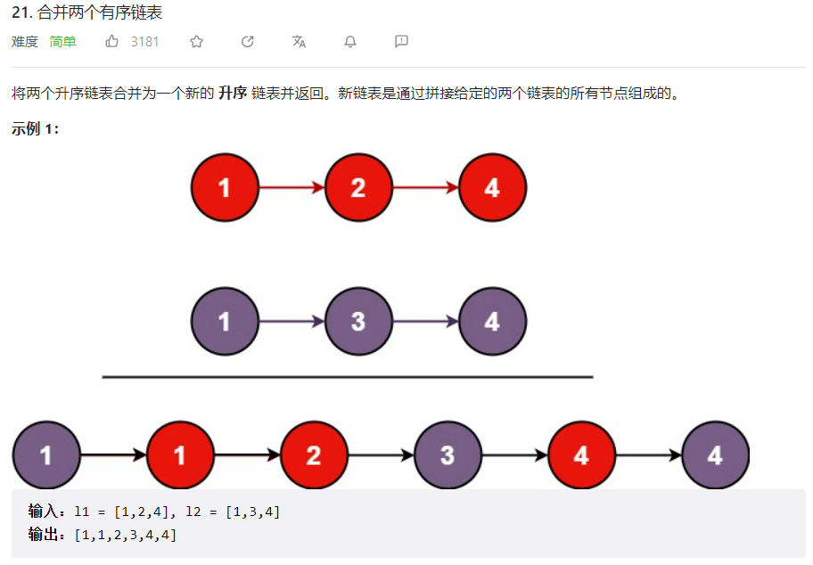
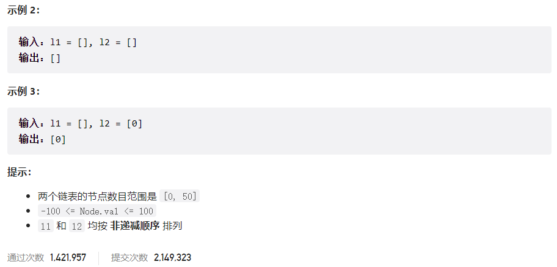



## 题目描述

> 🔥 [21. 合并两个有序链表](https://leetcode.cn/problems/merge-two-sorted-lists/)





## 思路分析

> 这道题目是链表的基础题目，我们可以使用递归或者迭代的方式来实现。

## 参考代码

```go
func mergeTwoLists(list1 *ListNode, list2 *ListNode) *ListNode {
	if list1 == nil {
		return list2
	} else if list2 == nil {
		return list1
	}
	if list1.Val < list2.Val {
		list1.Next = mergeTwoLists(list1.Next, list2)
		return list1
	} else {
		list2.Next = mergeTwoLists(list1, list2.Next)
		return list2
	}
}
```

```go
func mergeTwoLists(l1 *ListNode, l2 *ListNode) *ListNode {
	if l1 == nil {
		return l2
	} else if l2 == nil {
		return l1
	}
	dummy := &ListNode{}
	cur := dummy
	for l1 != nil && l2 != nil {
		if l1.Val < l2.Val {
			cur.Next = l1
			l1 = l1.Next
		} else {
			cur.Next = l2
			l2 = l2.Next
		}
		cur = cur.Next
	}
	if l1 != nil {
		cur.Next = l1
	}
	if l2 != nil {
		cur.Next = l2
	}
	return dummy.Next
}
```

<a class="button show-hidden">🍏 点击查看 Java 题解</a>

```java
class ListNode {
    int val;
    ListNode next;

    ListNode() {
    }

    ListNode(int val, ListNode next) {
        this.val = val;
        this.next = next;
    }
}

class Solution {
    public ListNode mergeTwoLists(ListNode l1, ListNode l2) {
        ListNode dummy = new ListNode();
        ListNode cur = dummy;
        while (l1 != null && l2 != null) {
            if (l1.val < l2.val) {
                cur.next = l1;
                l1 = l1.next;
            } else {
                cur.next = l2;
                l2 = l2.next;
            }
            cur = cur.next;
        }
        if (l1 != null) {
            cur.next = l1;
        }
        if (l2 != null) {
            cur.next = l2;
        }
        return dummy.next;
    }
}
```

```java
class ListNode {
    int val;
    ListNode next;

    ListNode() {
    }

    ListNode(int val, ListNode next) {
        this.val = val;
        this.next = next;
    }
}

class Solution {
    public ListNode mergeTwoLists(ListNode l1, ListNode l2) {
        if (l1 == null) {
            return l2;
        } else if (l2 == null) {
            return l1;
        }
        if (l1.val < l2.val) {
            l1.next = mergeTwoLists(l1.next, l2);
            return l1;
        } else {
            l2.next = mergeTwoLists(l1, l2.next);
            return l2;
        }
    }
}
```

## 相似题目

| 题目                                                         | 难度   | 题解 |
| ------------------------------------------------------------ | ------ | ---- |
| [合并 K 个升序链表](https://leetcode.cn/problems/merge-k-sorted-lists/) | Hard |      |
| [合并两个有序数组](https://leetcode.cn/problems/merge-sorted-array/) | Easy |      |
| [排序链表](https://leetcode.cn/problems/sort-list/) | Medium |      |
| [最短单词距离 II](https://leetcode.cn/problems/shortest-word-distance-ii/) | Medium |      |
