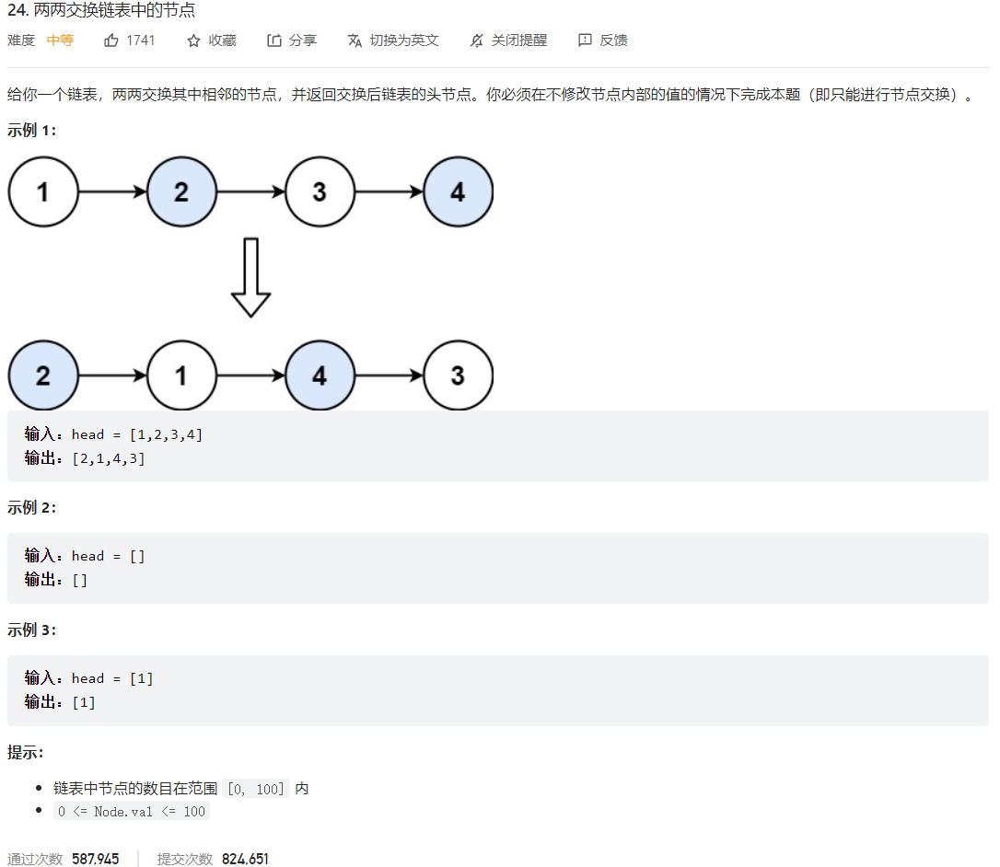



## 题目描述

> 🔥 [24. 两两交换链表中的节点](https://leetcode.cn/problems/swap-nodes-in-pairs/)



## 思路分析

> 递归和迭代

## 参考代码

```go
write your code here
```

<a class="button show-hidden">🍏 点击查看 Java 题解</a>

```java
write your code here
```

## 相似题目

| 题目                                                         | 难度   | 题解 |
| ------------------------------------------------------------ | ------ | ---- |
| [K 个一组翻转链表](https://leetcode.cn/problems/reverse-nodes-in-k-group/) | Hard |      |
