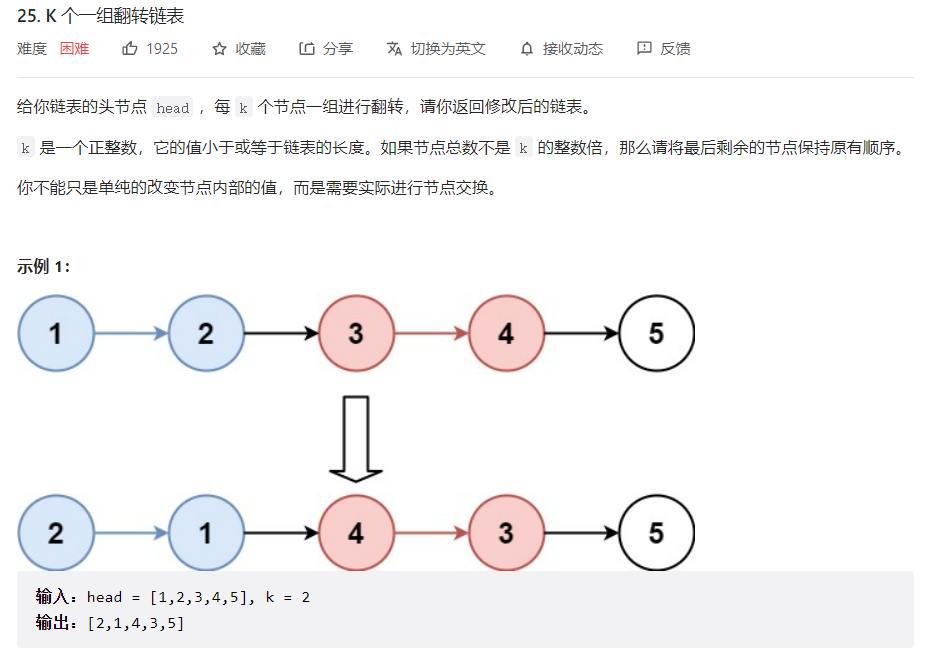
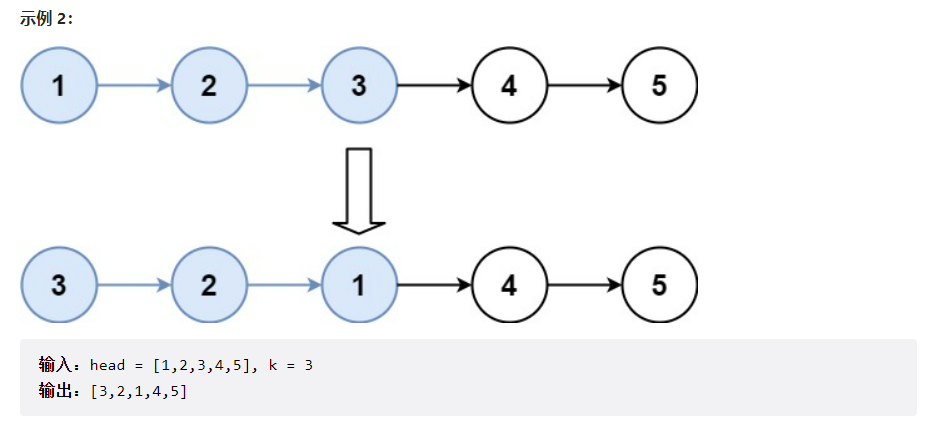



## 题目描述

> 🔥 [25. K 个一组翻转链表](https://leetcode.cn/problems/reverse-nodes-in-k-group/)





## 思路分析

> 递归

## 参考代码

```go
func reverseKGroup(head *ListNode, k int) *ListNode {
	if head == nil || k == 1 {
		return head
	}
	tail := head
	for i := 0; i < k; i++ {
		if tail == nil {
			return head
		}
		tail = tail.Next
	}
	newHead := reverse(head, tail)
	head.Next = reverseKGroup(tail, k)
	return newHead
}

func reverse(head *ListNode, tail *ListNode) *ListNode {
	var pre *ListNode
	cur := head
	for cur != tail {
		next := cur.Next
		cur.Next = pre
		pre = cur
		cur = next
	}
	return pre
}
```

<a class="button show-hidden">🍏 点击查看 Java 题解</a>

```java
write your code here
```

## 相似题目

| 题目                                                         | 难度   | 题解 |
| ------------------------------------------------------------ | ------ | ---- |
| [两两交换链表中的节点](https://leetcode.cn/problems/swap-nodes-in-pairs/) | Medium |      |
