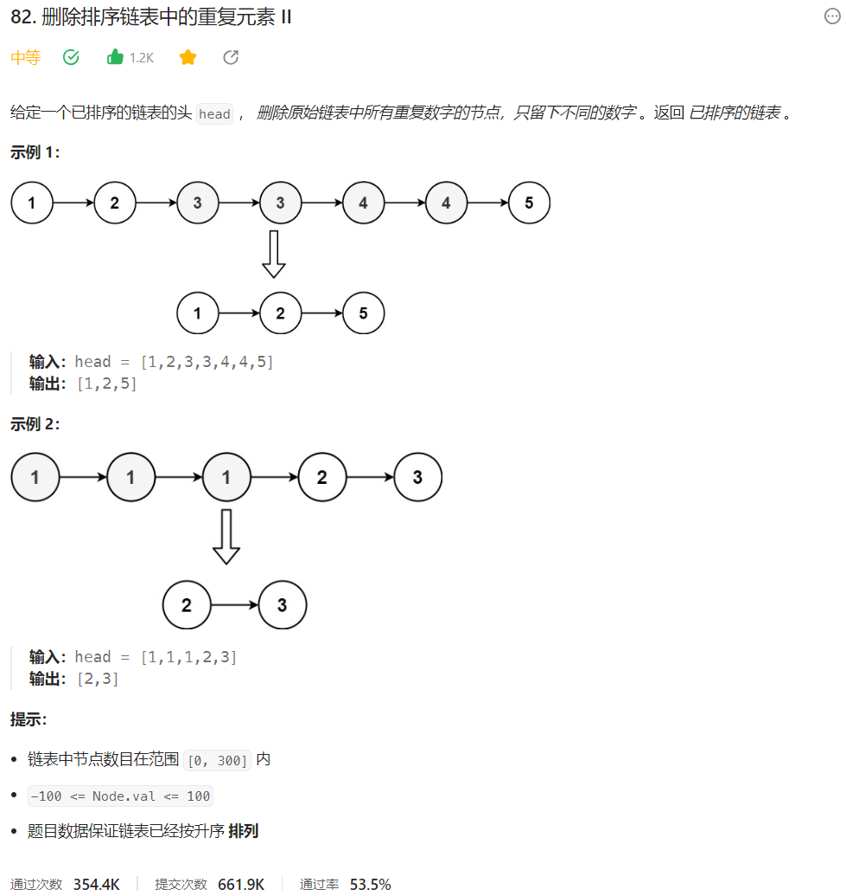



## 题目描述

> 🔥 [82. 删除排序链表中的重复元素 II](https://leetcode.cn/problems/remove-duplicates-from-sorted-list-ii/)



## 思路分析

> 思路描述

## 参考代码

```go
func deleteDuplicates(head *ListNode) *ListNode {
	dummy := &ListNode{Next: head}
	pre, cur := dummy, head
	for cur != nil && cur.Next != nil {
		if cur.Next.Val == cur.Val {
			for cur.Next != nil && cur.Next.Val == cur.Val {
				cur = cur.Next
			}
			pre.Next = cur.Next
		} else {
			pre = cur
		}
		cur = cur.Next
	}
	return dummy.Next
}
```

```go
func deleteDuplicates(head *ListNode) *ListNode {
	dummy := &ListNode{Next: head}
	pre, cur := dummy, head
	for cur != nil {
		isDuplicate := false
		for cur.Next != nil && cur.Next.Val == cur.Val {
			cur = cur.Next
			isDuplicate = true
		}
		if isDuplicate {
			pre.Next = cur.Next
		} else {
			pre = cur
		}
		cur = cur.Next
	}
	return dummy.Next
}
```

<a class="button show-hidden">🍏 点击查看 Java 题解</a>

```java
class Solution {
    public ListNode deleteDuplicates(ListNode head) {
        if (head == null || head.next == null) {
            return head;
        }
        ListNode dummy = new ListNode();
        dummy.next = head;
        ListNode pre = dummy;
        ListNode cur = head;
        while (cur != null && cur.next != null) {
            if (cur.next.val == cur.val) {
                while (cur.next != null && cur.next.val == cur.val) {
                    cur = cur.next;
                }
                pre.next = cur.next;
            } else {
                pre = cur;
            }
            cur = cur.next;
        }
        return dummy.next;
    }
}
```

## 相似题目

| 题目                                                         | 难度   | 题解 |
| ------------------------------------------------------------ | ------ | ---- |
| [删除排序链表中的重复元素](https://leetcode.cn/problems/remove-duplicates-from-sorted-list/) | Easy |      |
