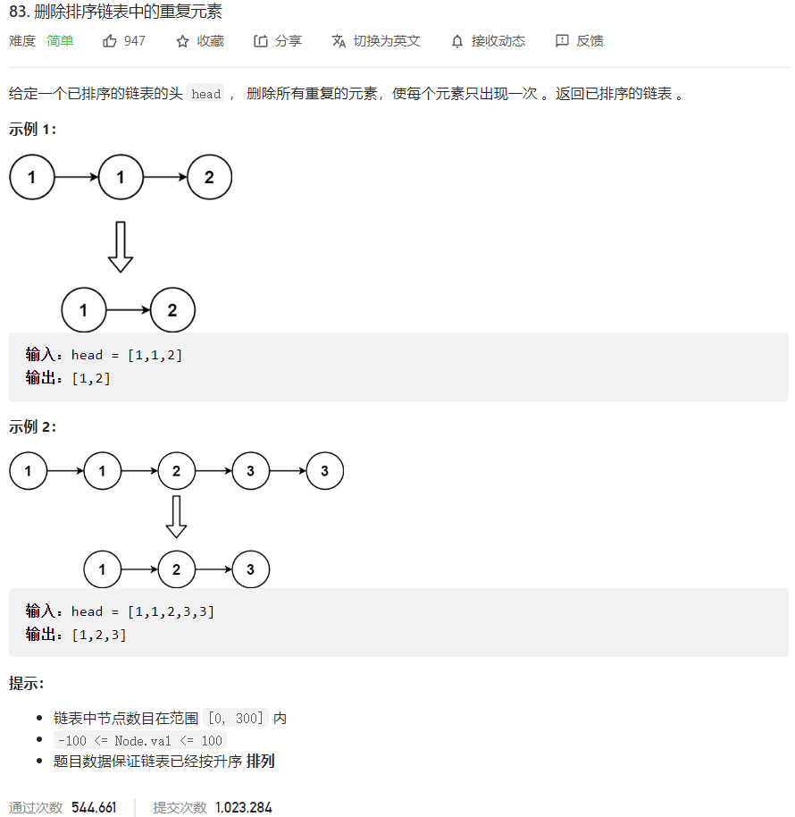



## 题目描述

> 🔥 [83. 删除排序链表中的重复元素](https://leetcode.cn/problems/remove-duplicates-from-sorted-list/)



## 思路分析

> 思路描述

## 参考代码

```go
func deleteDuplicates(head *ListNode) *ListNode {
	if head == nil || head.Next == nil {
		return head
	}
	cur := head
	for cur != nil && cur.Next != nil {
		if cur.Next.Val == cur.Val {
			cur.Next = cur.Next.Next
		} else {
			cur = cur.Next
		}
	}
	return head
}
```

<a class="button show-hidden">🍏 点击查看 Java 题解</a>

```java
write your code here
```

## 相似题目

| 题目                                                         | 难度   | 题解 |
| ------------------------------------------------------------ | ------ | ---- |
| [删除排序链表中的重复元素 II](https://leetcode.cn/problems/remove-duplicates-from-sorted-list-ii/) | Medium |      |
