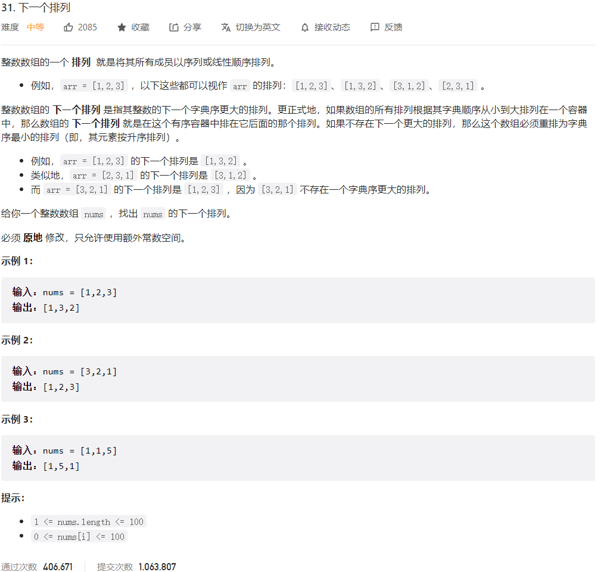
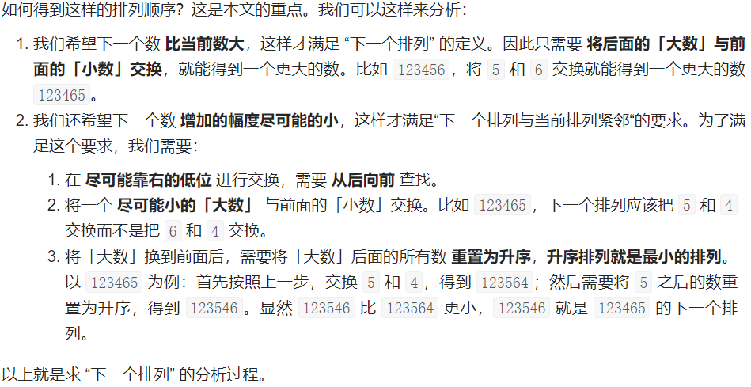



## 题目描述

> 🔥 [31. 下一个排列](https://leetcode.cn/problems/next-permutation/)



## 思路分析

> 1. 从右向左遍历数组，找到第一个相邻的数字对 (i, i+1)，满足 nums[i] < nums[i+1]。
> 2. 如果找到了这样的数字对，再次从右向左遍历数组，找到第一个数字 j，满足 nums[j] > nums[i]。
> 3. 交换 nums[i] 和 nums[j]。
> 4. 将从 i+1 开始到数组末尾的部分进行翻转，使其变成升序。
> 5. 如果步骤 1 中没有找到数字对，说明整个数组已经是最大排列，直接翻转整个数组。

```go
步骤 1：1 3 5 4 2
步骤 2：1 4 5 3 2
步骤 3：1 4 2 3 5
```



## 参考代码

```go
func nextPermutation(nums []int) {
	if len(nums) <= 1 {
		return
	}
	i := len(nums) - 2
	for i >= 0 && nums[i] >= nums[i+1] {
		i--
	}
	if i >= 0 {
		j := len(nums) - 1
		for nums[j] <= nums[i] {
			j--
		}
		nums[i], nums[j] = nums[j], nums[i]
	}
	left, right := i+1, len(nums)-1
	for left < right {
		nums[left], nums[right] = nums[right], nums[left]
		left++
		right--
	}
}
```

> 考虑序列 `[1, 3, 5, 4, 2]`，我们可以按照以下步骤找到下一个排列：
>
> 1. 从右向左找到第一个相邻数字对 (3, 5)，满足 3 < 5，此时 `i = 1`。
> 2. 从右向左找到第一个大于 3 的数字，是 4，将其与 3 交换，序列变为 `[1, 4, 5, 3, 2]`。
> 3. 对从位置 `i+1` 开始的部分 `[5, 3, 2]` 进行翻转，得到 `[1, 4, 2, 3, 5]`，这就是下一个排列。
>
> 在这个示例中，我们从逻辑上解释了代码的每个步骤，说明了如何找到下一个排列并进行交换和翻转。

<a class="button show-hidden">🍏 点击查看 Java 题解</a>

```java
write your code here
```

## 相似题目

| 题目                                                         | 难度   | 题解 |
| ------------------------------------------------------------ | ------ | ---- |
| [全排列](https://leetcode.cn/problems/permutations/) | Medium |      |
| [全排列 II](https://leetcode.cn/problems/permutations-ii/) | Medium |      |
| [排列序列](https://leetcode.cn/problems/permutation-sequence/) | Hard |      |
| [回文排列 II](https://leetcode.cn/problems/palindrome-permutation-ii/) | Medium |      |
