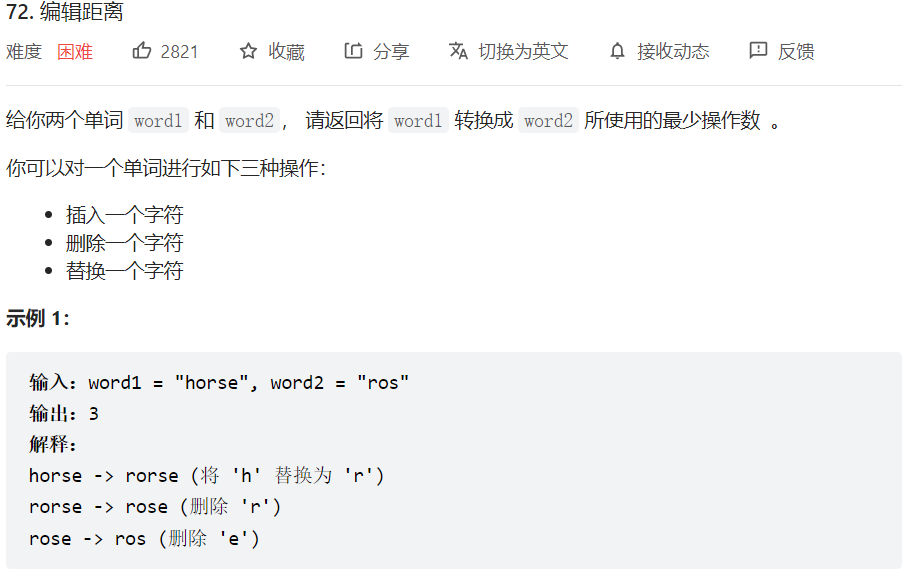
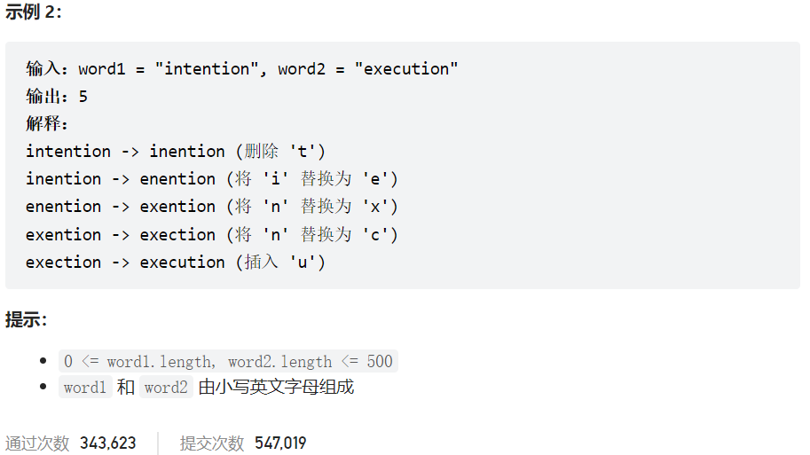



## 题目描述

> 🔥 [72. 编辑距离](https://leetcode.cn/problems/edit-distance/)





## 思路分析

> `dp[i][j]` 表示 word1 的前 i 个字符转换成 word2 的前 j 个字符所需要的最少操作

## 参考代码

```go
write your code here
```

<a class="button show-hidden">🍏 点击查看 Java 题解</a>

```java
write your code here
```

## 相似题目

| 题目                                                         | 难度   | 题解 |
| ------------------------------------------------------------ | ------ | ---- |
| [最长公共子序列](https://leetcode.cn/problems/longest-common-subsequence/) | Medium |      |
| [相隔为 1 的编辑距离](https://leetcode.cn/problems/one-edit-distance/) | Medium |      |
| [两个字符串的删除操作](https://leetcode.cn/problems/delete-operation-for-two-strings/) | Medium |      |
| [两个字符串的最小 ASCII 删除和](https://leetcode.cn/problems/minimum-ascii-delete-sum-for-two-strings/) | Medium |      |
| [不相交的线](https://leetcode.cn/problems/uncrossed-lines/)  | Medium |      |
