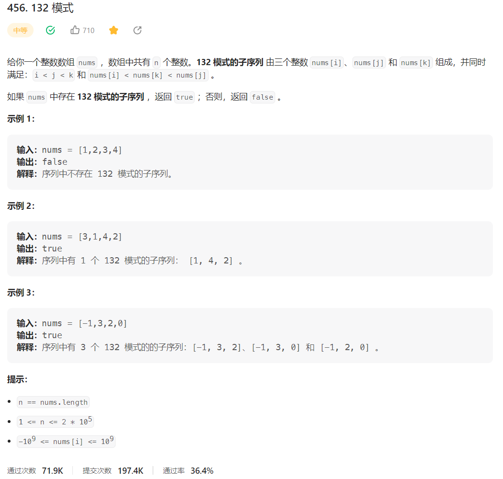



## 题目描述

> 🔥 [456. 132 模式](https://leetcode.cn/problems/132-pattern/)



## 思路分析

> 单调递减栈

## 参考代码

```go
write your code here
```

<a class="button show-hidden">🍏 点击查看 Java 题解</a>

```java
write your code here
```
