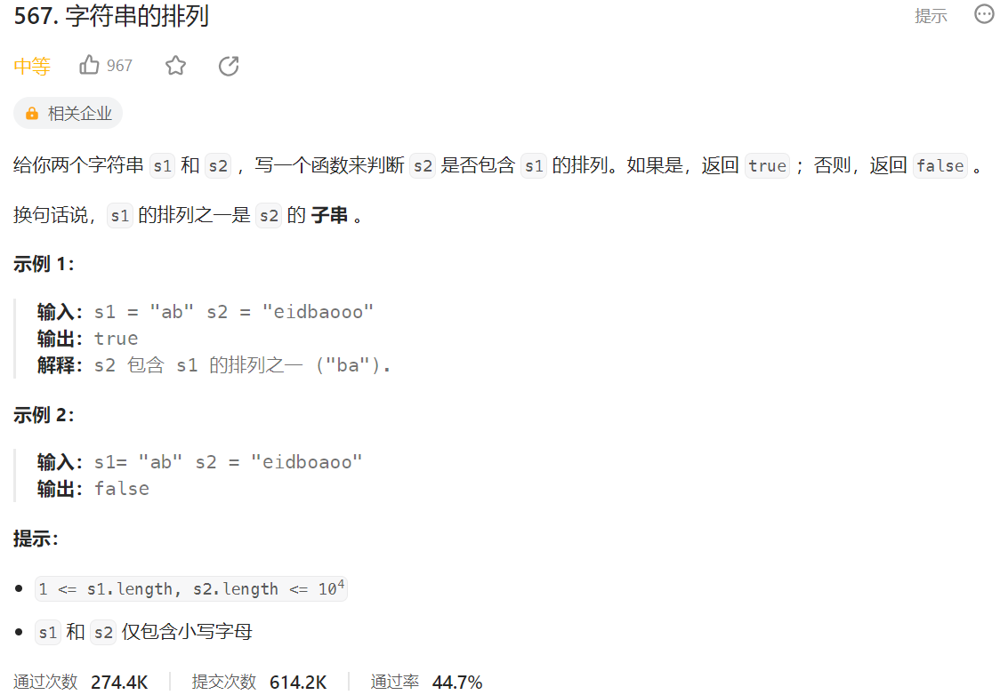



## 题目描述

> 🔥 [567. 字符串的排列](https://leetcode.cn/problems/permutation-in-string/)



## 思路分析

> 1. 如果`s1`的长度大于`s2`的长度，那么一定不可能包含`s1`的排列，直接返回`false`。
> 2. 初始化两个映射：`window`和`need`。`window`用于存储`s1`中每个字符的频次，`need`用于存储滑动窗口中字符的频次。
> 3. 使用双指针`left`和`right`来遍历`s2`。右指针不断扩展窗口，而左指针在窗口大小大于`s1`长度时右移。
> 4. 在遍历过程中，维护`need`映射。当右指针扩展窗口时，增加相应字符的频次，当左指针右移时，减少相应字符的频次。如果字符频次减少到0，就从`need`映射中删除该字符。
> 5. 如果`need`映射的长度等于`window`映射的长度，并且两个映射相等，说明找到了`s2`中的一个排列，返回`true`。
> 6. 如果遍历完整个`s2`都没有找到满足条件的排列，返回`false`。
>
> 这个算法的时间复杂度是O(n)，其中N是`s2`的长度。在最坏情况下，左指针和右指针都会遍历整个`s2`字符串。

## 参考代码

```go
func checkInclusion(s1 string, s2 string) bool {
	if len(s1) > len(s2) {
		return false
	}
	window := make(map[byte]int)
	for i := 0; i < len(s1); i++ {
		window[s1[i]]++
	}
	need := make(map[byte]int)
	left, right := 0, 0
	for right < len(s2) {
		need[s2[right]]++
		if right-left+1 > len(s1) {
			c := s2[left]
			need[c]--
			if need[c] == 0 {
				delete(need, c)
			}
			left++
		}
		if len(need) == len(window) {
			if reflect.DeepEqual(need, window) {
				return true
			}
		}
		right++
	}
	return false
}
```

<a class="button show-hidden">🍏 点击查看 Java 题解</a>

```java
write your code here
```

## 相似题目

| 题目                                                         | 难度   | 题解 |
| ------------------------------------------------------------ | ------ | ---- |
| [最小覆盖子串](https://leetcode.cn/problems/minimum-window-substring/) | Hard |      |
| [找到字符串中所有字母异位词](https://leetcode.cn/problems/find-all-anagrams-in-a-string/) | Medium |      |
