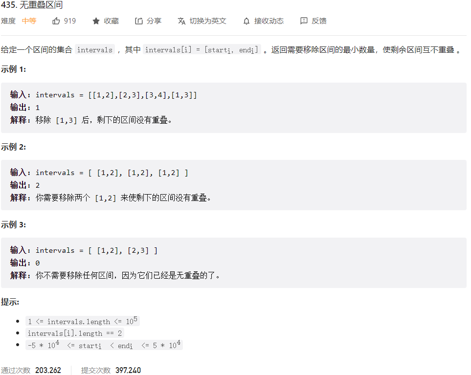



## 题目描述

> 🔥 [435. 无重叠区间](https://leetcode.cn/problems/non-overlapping-intervals/)



## 思路分析

> **方法一：贪心算法**
>
> 1. 将所有区间按照右端点从小到大排序。
> 2. 从第一个区间开始，依次判断后面的区间是否与当前区间重叠，如果重叠，则删除右端点较大的那个区间。
> 3. 继续判断下一个区间，直到所有区间都被遍历完。

## 参考代码

```go
func eraseOverlapIntervals(intervals [][]int) int {
	n := len(intervals)
	if n <= 0 {
		return 0
	}
	sort.Slice(intervals, func(i, j int) bool {
		return intervals[i][1] < intervals[j][1]
	})
	count := 1
	end := intervals[0][1]
	for i := 1; i < n; i++ {
		if end <= intervals[i][0] {
			count++
			end = intervals[i][1]
		}
	}
	return n - count
}
```

<a class="button show-hidden">🍏 点击查看 Java 题解</a>

```java
write your code here
```

## 相似题目

| 题目                                                         | 难度   | 题解 |
| ------------------------------------------------------------ | ------ | ---- |
| [用最少数量的箭引爆气球](https://leetcode.cn/problems/minimum-number-of-arrows-to-burst-balloons/) | Medium |      |
