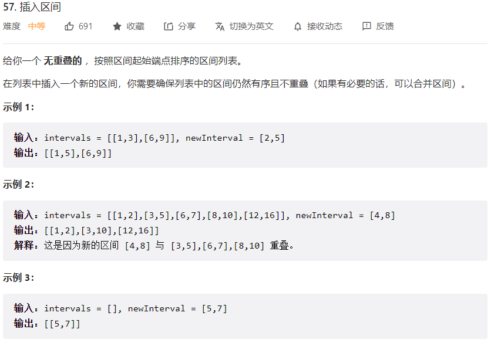
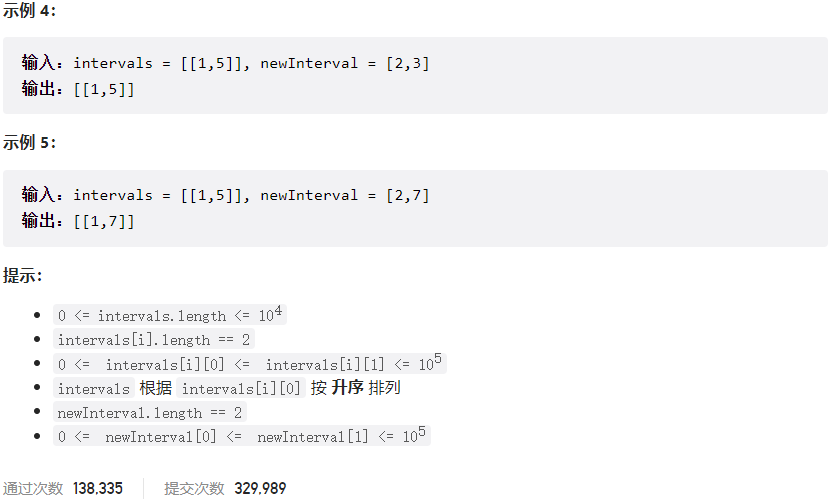



## 题目描述

> 🔥 [57. 插入区间](https://leetcode.cn/problems/insert-interval/)





## 思路分析

> **方法一：暴力枚举**
>
> - 首先将新区间插入到原区间列表中，保证区间列表有序。
> - 遍历区间列表，将与新区间有交集的区间合并成一个新的区间。
> - 将合并后的区间和未合并的区间加入到结果列表中。
>
> **方法二：模拟**
>
> - 遍历区间列表，找到新区间应该插入的位置，将其插入到列表中。
>- 合并重叠的区间，具体做法是维护一个当前区间，遍历区间列表，如果当前区间与下一个区间重叠，则将当前区间扩展到两个区间的并集，继续遍历，直到当前区间与下一个区间不重叠为止。

## 参考代码

```go
write your code here
```

<a class="button show-hidden">🍏 点击查看 Java 题解</a>

```java
write your code here
```

## 相似题目

| 题目                                                         | 难度   | 题解 |
| ------------------------------------------------------------ | ------ | ---- |
| [合并区间](https://leetcode.cn/problems/merge-intervals/) | Medium |      |
| [Range 模块](https://leetcode.cn/problems/range-module/) | Hard |      |
