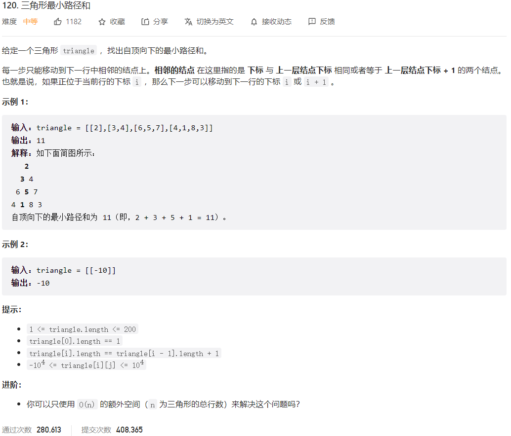



## 题目描述

> 🔥 [120. 三角形最小路径和](https://leetcode.cn/problems/triangle/)



## 思路分析

> **思路分析：**
>
> 1. 首先，我们从三角形的倒数第二行开始向上遍历，逐个计算每个位置的最小路径和。因为最后一行的路径和已经确定，所以我们从倒数第二行开始向上遍历可以逐步将路径和信息传递到顶部。
> 2. 对于每个位置 `(i, j)`，我们需要考虑下一行中相邻的两个位置 `(i+1, j)` 和 `(i+1, j+1)`，然后将当前位置的值更新为当前值加上这两个相邻位置中的较小值。这样，我们可以得到从当前位置到底部的最小路径和。
> 3. 最终，当我们遍历到三角形的顶部位置 `(0, 0)` 时，它的值就是从顶部到底部的最小路径和。
>
> 通过这个动态规划的思路，我们不断逐层计算路径和，最终得到整个三角形的最小路径和。这个方法的时间复杂度是 O(n^2)，其中 n 是三角形的行数。

## 参考代码

```go
func minimumTotal(triangle [][]int) int {
	n := len(triangle)
	// 从倒数第二行开始向上遍历
	for i := n - 2; i >= 0; i-- {
		for j := 0; j < len(triangle[i]); j++ {
			// 在原数组上更新每个位置的值为当前值加上下一行相邻位置的较小值
			triangle[i][j] += min(triangle[i+1][j], triangle[i+1][j+1])
		}
	}
	return triangle[0][0]
}

func min(a, b int) int {
	if a < b {
		return a
	}
	return b
}
```

<a class="button show-hidden">🍏 点击查看 Java 题解</a>

```java
write your code here
```
