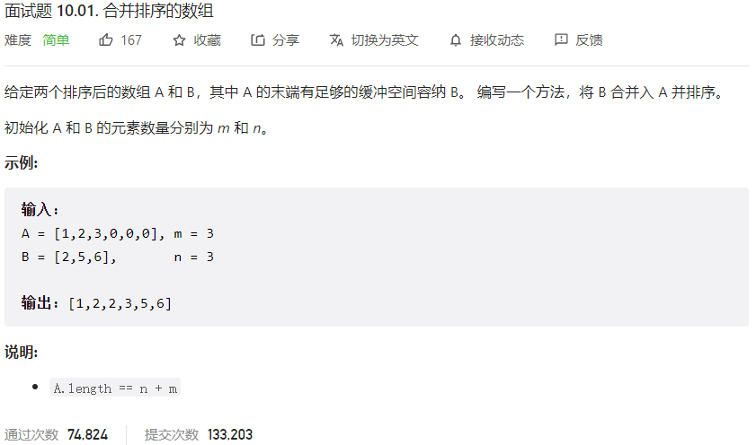



## 题目描述

> 🔥 [面试题 10.01. 合并排序的数组](https://leetcode.cn/problems/sorted-merge-lcci/)



## 思路分析

> 思路描述

## 参考代码

```go
write your code here
```

<a class="button show-hidden">🍏 点击查看 Java 题解</a>

```java
write your code here
```
