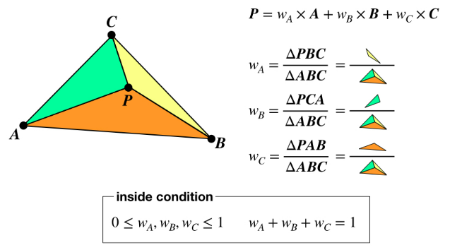
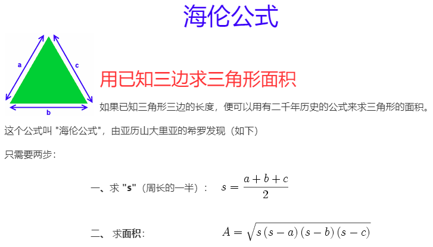



## 题目描述

> 🔥 [面试高频题-如何判断一个点是否在三角形内部](https://www.nowcoder.com/questionTerminal/f9c4290baed0406cbbe2c23dd687732c)

## 思路分析

> 面积法





>向量叉乘

## 参考代码

```go
write your code here
```

<a class="button show-hidden">🍏 点击查看 Java 题解</a>

```java
write your code here
```
