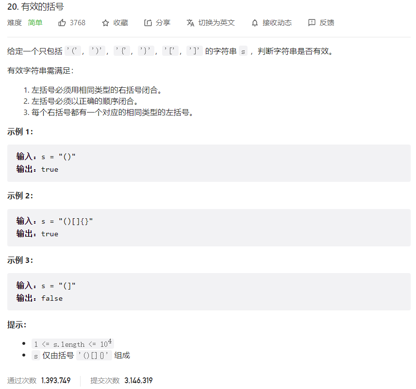



## 题目描述

> 🔥 [20. 有效的括号](https://leetcode.cn/problems/valid-parentheses/)



## 思路分析

> 栈

## 参考代码

```go
func isValid(s string) bool {
	stack := make([]rune, 0)
	hashtable := map[rune]rune{
		'(': ')',
		'[': ']',
		'{': '}',
	}
	for _, c := range s {
		if c == '(' || c == '[' || c == '{' {
			stack = append(stack, c)
		} else {
			if len(stack) > 0 && hashtable[stack[len(stack)-1]] == c {
				stack = stack[:len(stack)-1]
			} else {
				return false
			}
		}
	}
	return len(stack) == 0
}
```

```go
func isValid(s string) bool {
	stack := make([]rune, 0)
	hashtable := map[rune]rune{
		')': '(',
		']': '[',
		'}': '{',
	}
	for _, c := range s {
		if c == '(' || c == '[' || c == '{' {
			stack = append(stack, c)
		} else {
			if len(stack) == 0 || stack[len(stack)-1] != hashtable[c] {
				return false
			} else {
				stack = stack[:len(stack)-1]
			}
		}
	}
	return len(stack) == 0
}
```

<a class="button show-hidden">🍏 点击查看 Java 题解</a>

```java
class Solution {
    public boolean isValid(String s) {
        Map<Character, Character> map = new HashMap<>();
        map.put(')', '(');
        map.put(']', '[');
        map.put('}', '{');
        Stack<Character> stack = new Stack<>();
        for (char c : s.toCharArray()) {
            if (map.containsKey(c)) {
                if (stack.isEmpty() || stack.peek() != map.get(c)) {
                    return false;
                } else {
                    stack.pop();
                }
            } else {
                stack.push(c);
            }
        }
        return stack.isEmpty();
    }
}
```

## 相似题目

| 题目                                                         | 难度   | 题解 |
| ------------------------------------------------------------ | ------ | ---- |
| [括号生成](https://leetcode.cn/problems/generate-parentheses/) | Medium |      |
| [最长有效括号](https://leetcode.cn/problems/longest-valid-parentheses/) | Hard |      |
| [删除无效的括号](https://leetcode.cn/problems/remove-invalid-parentheses/) | Hard |      |
| [检查替换后的词是否有效](https://leetcode.cn/problems/check-if-word-is-valid-after-substitutions/) | Medium |      |
