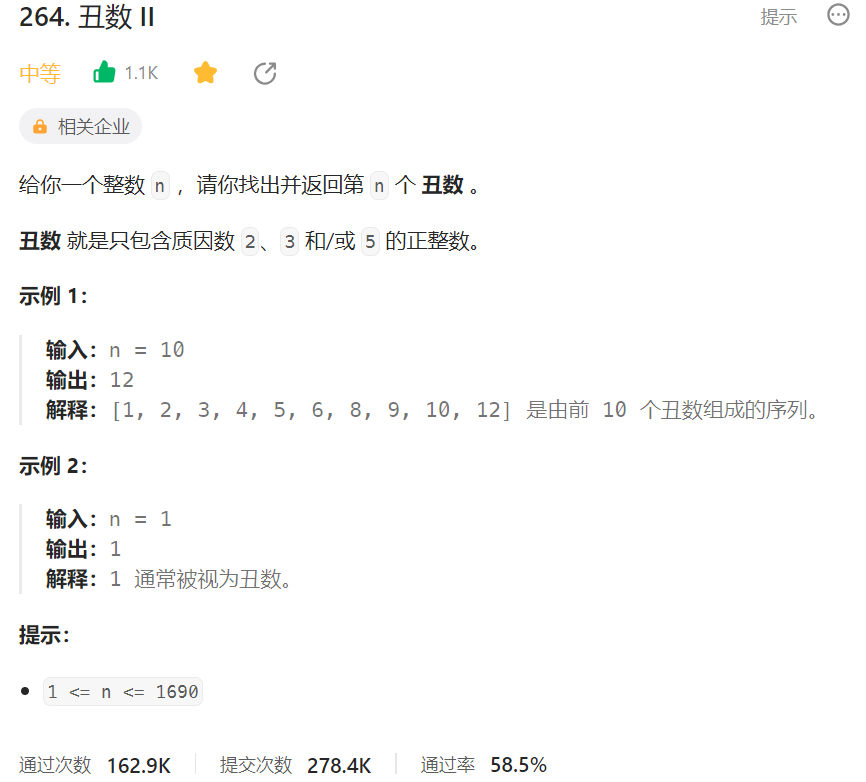



## 题目描述

> 🔥 [264. 丑数 II](https://leetcode.cn/problems/ugly-number-ii/)



## 思路分析

> 三指针

## 参考代码

```go
func nthUglyNumber(n int) int {
	dp := make([]int, n)
	dp[0] = 1 // 第一个丑数是 1

	p2, p3, p5 := 0, 0, 0 // 三个指针初始都指向第一个丑数

	for i := 1; i < n; i++ {
		// 计算下一个丑数，取三者中最小值
		next := min(dp[p2]*2, min(dp[p3]*3, dp[p5]*5))
		dp[i] = next

		// 更新指针
		if next == dp[p2]*2 {
			p2++
		}
		if next == dp[p3]*3 {
			p3++
		}
		if next == dp[p5]*5 {
			p5++
		}
	}

	return dp[n-1]
}

func min(a, b int) int {
	if a < b {
		return a
	}
	return b
}
```

<a class="button show-hidden">🍏 点击查看 Java 题解</a>

```java
write your code here
```

## 相似题目

| 题目                                                         | 难度   | 题解 |
| ------------------------------------------------------------ | ------ | ---- |
| [合并 K 个升序链表](https://leetcode.cn/problems/merge-k-sorted-lists/) | Hard |      |
| [计数质数](https://leetcode.cn/problems/count-primes/) | Medium |      |
| [丑数](https://leetcode.cn/problems/ugly-number/) | Easy |      |
| [完全平方数](https://leetcode.cn/problems/perfect-squares/) | Medium |      |
| [超级丑数](https://leetcode.cn/problems/super-ugly-number/) | Medium |      |
