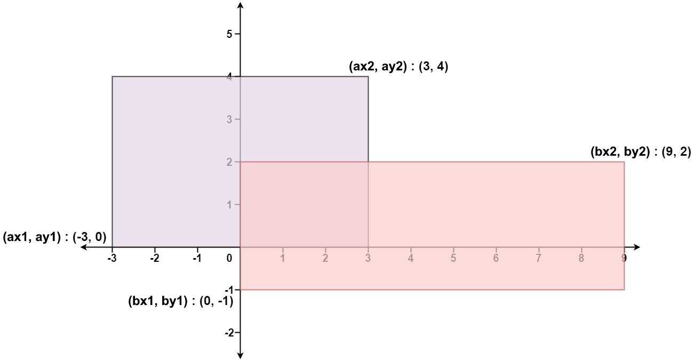



## 题目描述

> 🔥 [223. 矩形面积](https://leetcode.cn/problems/rectangle-area/)

## 思路分析

> 思路描述



## 参考代码

```go
write your code here
```

<a class="button show-hidden">🍏 点击查看 Java 题解</a>

```java
write your code here
```

## 相似题目

| 题目                                                         | 难度   | 题解 |
| ------------------------------------------------------------ | ------ | ---- |
| [矩形重叠](https://leetcode.cn/problems/rectangle-overlap/) | Easy |      |
