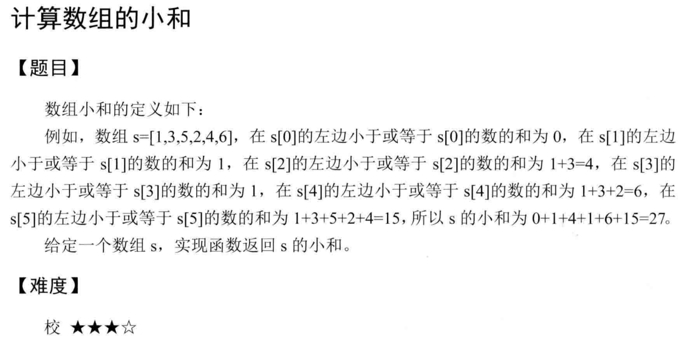



## 题目描述

> 🔥 [面试高频题-计算数组的小和](https://www.nowcoder.com/practice/6dca0ebd48f94b4296fc11949e3a91b8)



## 思路分析

> 归并排序
>

## 参考代码

```go
write your code here
```

<a class="button show-hidden">🍏 点击查看 Java 题解</a>

```java
write your code here
```
