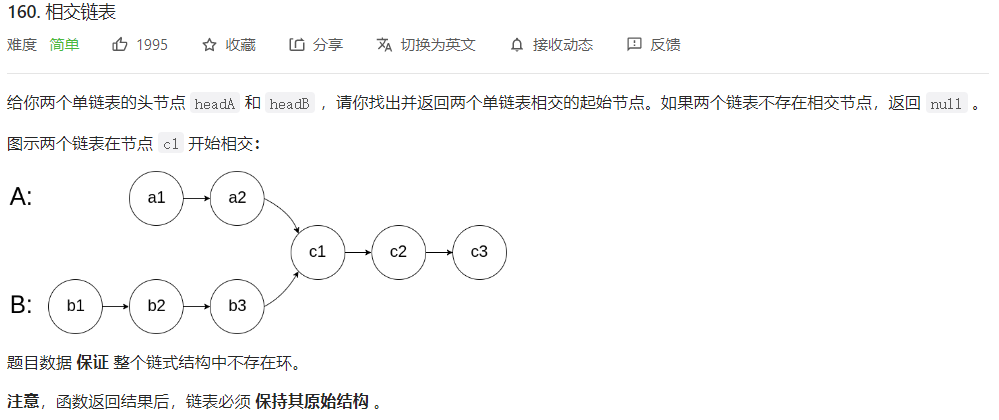



## 题目描述

> 🔥 [160. 相交链表](https://leetcode.cn/problems/intersection-of-two-linked-lists/)



## 思路分析

> **朋友们，请一定要珍惜身边的那个 ta 啊！你们之所以相遇，正是因为你走了 ta 走过的路，而 ta 也刚好走了你走过的路。这是何等的缘分！**
>
> 双指针
>
> 哈希集合

## 参考代码

```go
func getIntersectionNode(headA, headB *ListNode) *ListNode {
	a, b := headA, headB
	for a != b {
		if a != nil {
			a = a.Next
		} else {
			a = headB
		}
		if b != nil {
			b = b.Next
		} else {
			b = headA
		}
	}
	return a
}
```

<a class="button show-hidden">🍏 点击查看 Java 题解</a>

```java
write your code here
```

## 相似题目

| 题目                                                         | 难度   | 题解 |
| ------------------------------------------------------------ | ------ | ---- |
| [两个列表的最小索引总和](https://leetcode.cn/problems/minimum-index-sum-of-two-lists/) | Easy |      |
