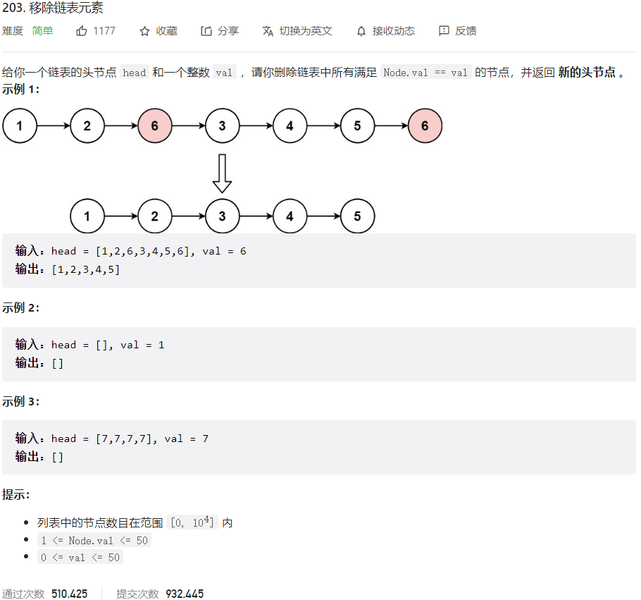



## 题目描述

> 🔥 [203. 移除链表元素](https://leetcode.cn/problems/remove-linked-list-elements/)



## 思路分析

> 双指针
>
> 递归

## 参考代码

```go
func removeElements(head *ListNode, val int) *ListNode {
	dummy := &ListNode{Next: head}
	pre, cur := dummy, head
	for cur != nil {
		if cur.Val == val {
			pre.Next = cur.Next
		} else {
			pre = cur
		}
		cur = cur.Next
	}
	return dummy.Next
}
```

<a class="button show-hidden">🍏 点击查看 Java 题解</a>

```java
write your code here
```

## 相似题目

| 题目                                                         | 难度   | 题解 |
| ------------------------------------------------------------ | ------ | ---- |
| [移除元素](https://leetcode.cn/problems/remove-element/) | Easy |      |
| [删除链表中的节点](https://leetcode.cn/problems/delete-node-in-a-linked-list/) | Medium |      |
