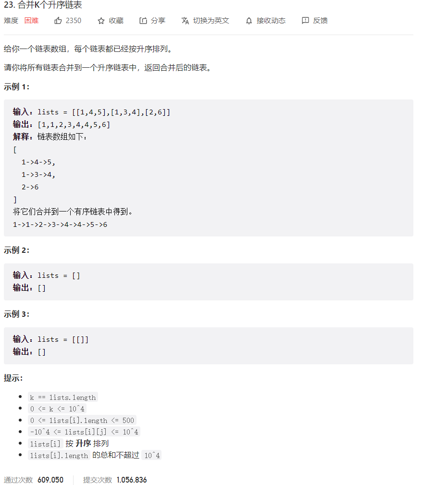



## 题目描述

> 🔥 [23. 合并 K 个升序链表](https://leetcode.cn/problems/merge-k-sorted-lists/)



## 思路分析

> 归并排序

## 参考代码

```go
func mergeKLists(lists []*ListNode) *ListNode {
	if len(lists) == 0 {
		return nil
	} else if len(lists) == 1 {
		return lists[0]
	}
	mid := len(lists) / 2
	l1 := mergeKLists(lists[:mid])
	l2 := mergeKLists(lists[mid:])
	return mergeTwoLists(l1, l2)
}

func mergeTwoLists(l1 *ListNode, l2 *ListNode) *ListNode {
	if l1 == nil {
		return l2
	} else if l2 == nil {
		return l1
	}
	if l1.Val < l2.Val {
		l1.Next = mergeTwoLists(l1.Next, l2)
		return l1
	} else {
		l2.Next = mergeTwoLists(l1, l2.Next)
		return l2
	}
}
```

```go
func mergeKLists(lists []*ListNode) *ListNode {
	if len(lists) == 0 {
		return nil
	} else if len(lists) == 1 {
		return lists[0]
	}
	mid := len(lists) / 2
	l1 := mergeKLists(lists[:mid])
	l2 := mergeKLists(lists[mid:])
	return mergeTwoLists(l1, l2)
}

func mergeTwoLists(l1 *ListNode, l2 *ListNode) *ListNode {
	if l1 == nil {
		return l2
	} else if l2 == nil {
		return l1
	}
	dummy := &ListNode{}
	cur := dummy
	for l1 != nil && l2 != nil {
		if l1.Val < l2.Val {
			cur.Next = l1
			l1 = l1.Next
		} else {
			cur.Next = l2
			l2 = l2.Next
		}
		cur = cur.Next
	}
	if l1 != nil {
		cur.Next = l1
	} else {
		cur.Next = l2
	}
	return dummy.Next
}
```

<a class="button show-hidden">🍏 点击查看 Java 题解</a>

```java
write your code here
```

## 相似题目

| 题目                                                         | 难度   | 题解 |
| ------------------------------------------------------------ | ------ | ---- |
| [合并两个有序链表](https://leetcode.cn/problems/merge-two-sorted-lists/) | Easy |      |
| [丑数 II](https://leetcode.cn/problems/ugly-number-ii/) | Medium |      |
