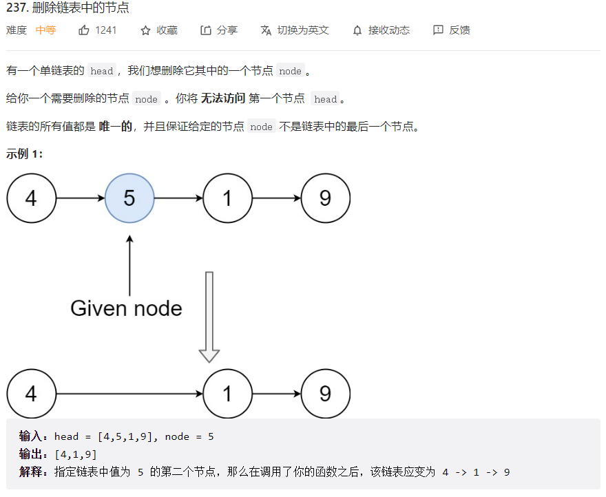
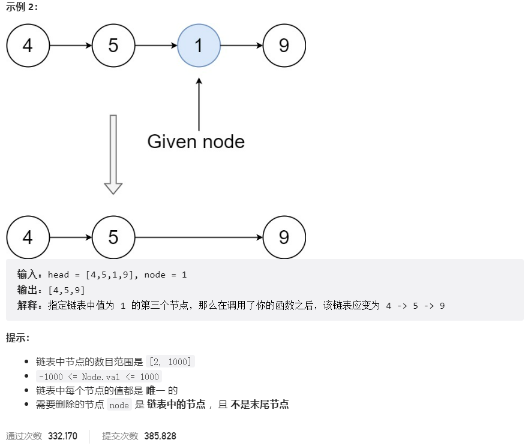



## 题目描述

> 🔥 [237. 删除链表中的节点](https://leetcode.cn/problems/delete-node-in-a-linked-list/)





## 思路分析

> 偷梁换柱

## 参考代码

```go
func deleteNode(node *ListNode) {
	node.Val = node.Next.Val
	node.Next = node.Next.Next
}
```

<a class="button show-hidden">🍏 点击查看 Java 题解</a>

```java
write your code here
```

## 相似题目

| 题目                                                         | 难度   | 题解 |
| ------------------------------------------------------------ | ------ | ---- |
| [移除链表元素](https://leetcode.cn/problems/remove-linked-list-elements/) | Easy |      |
