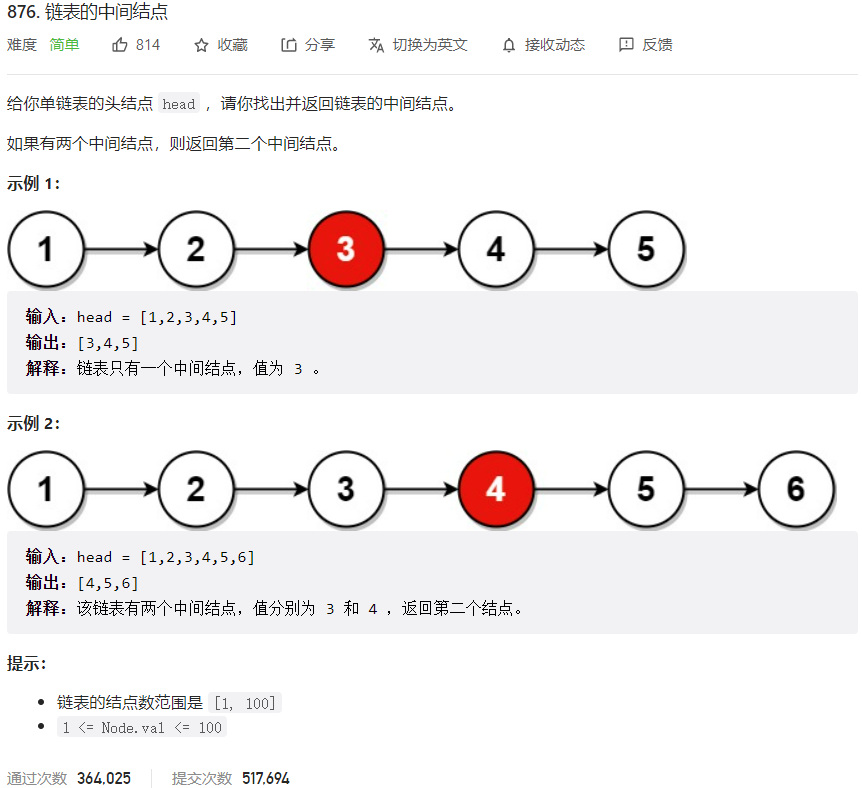



## 题目描述

> 🔥 [876. 链表的中间结点](https://leetcode.cn/problems/middle-of-the-linked-list/)



## 思路分析

> 快慢指针

## 参考代码

```go
func middleNode(head *ListNode) *ListNode {
	slow, fast := head, head
	for fast != nil && fast.Next != nil {
		slow = slow.Next
		fast = fast.Next.Next
	}
	return slow
}
```

<a class="button show-hidden">🍏 点击查看 Java 题解</a>

```java
write your code here
```
