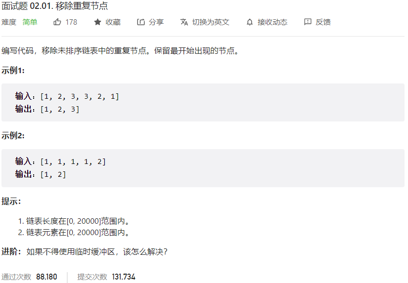



## 题目描述

> 🔥 [面试题 02.01. 移除重复节点](https://leetcode.cn/problems/remove-duplicate-node-lcci/)



## 思路分析

> 哈希表

## 参考代码

```go
func removeDuplicateNodes(head *ListNode) *ListNode {
	if head == nil || head.Next == nil {
		return head
	}
	visited := make(map[int]bool)
	var pre *ListNode
	cur := head
	for cur != nil {
		if _, ok := visited[cur.Val]; ok {
			pre.Next = cur.Next
		} else {
			visited[cur.Val] = true
			pre = cur
		}
		cur = cur.Next
	}
	return head
}
```

<a class="button show-hidden">🍏 点击查看 Java 题解</a>

```java
class Solution {
    public ListNode removeDuplicateNodes(ListNode head) {
        if (head == null || head.next == null) {
            return head;
        }
        ListNode pre = null, cur = head;
        Set<Integer> visited = new HashSet<>();
        while (cur != null) {
            if (visited.contains(cur.val)) {
                pre.next = cur.next;
            } else {
                visited.add(cur.val);
                pre = cur;
            }
            cur = cur.next;
        }
        return head;
    }
}
```
