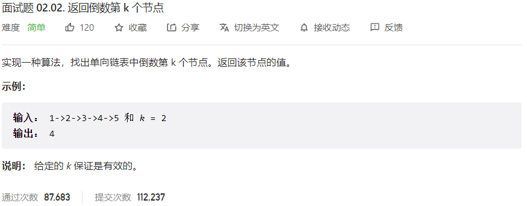



## 题目描述

> 🔥 [面试题 02.02. 返回倒数第 k 个节点](https://leetcode.cn/problems/kth-node-from-end-of-list-lcci/)



## 思路分析

> 快慢指针

## 参考代码

```go
func kthToLast(head *ListNode, k int) int {
	slow, fast := head, head
	for i := 0; i < k; i++ {
		if fast == nil {
			break
		}
		fast = fast.Next
	}
	for fast != nil {
		slow = slow.Next
		fast = fast.Next
	}
	return slow.Val
}
```

```go
func kthToLast(head *ListNode, k int) int {
	if head == nil || k <= 0 {
		return 0 // 需要根据实际情况返回合适的值
	}
	slow, fast := head, head
	// 先让 fast 指针前进 k 步
	for i := 0; i < k; i++ {
		if fast == nil {
			return 0 // 需要根据实际情况返回合适的值
		}
		fast = fast.Next
	}
	// 同时移动 slow 和 fast 指针
	for fast != nil {
		slow = slow.Next
		fast = fast.Next
	}
	return slow.Val
}
```

<a class="button show-hidden">🍏 点击查看 Java 题解</a>

```java
write your code here
```
