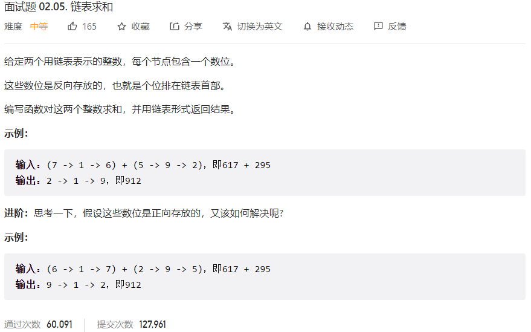



## 题目描述

> 🔥 [面试题 02.05. 链表求和](https://leetcode.cn/problems/sum-lists-lcci/)



## 思路分析

> 加法问题

## 参考代码

```go
func addTwoNumbers(l1 *ListNode, l2 *ListNode) *ListNode {
	if l1 == nil {
		return l2
	} else if l2 == nil {
		return l1
	}
	dummy := &ListNode{}
	cur := dummy
	carry := 0
	for l1 != nil || l2 != nil || carry > 0 {
		sum := carry
		if l1 != nil {
			sum += l1.Val
			l1 = l1.Next
		}
		if l2 != nil {
			sum += l2.Val
			l2 = l2.Next
		}
		carry = sum / 10
		cur.Next = &ListNode{Val: sum % 10}
		cur = cur.Next
	}
	return dummy.Next
}
```

<a class="button show-hidden">🍏 点击查看 Java 题解</a>

```java
write your code here
```
