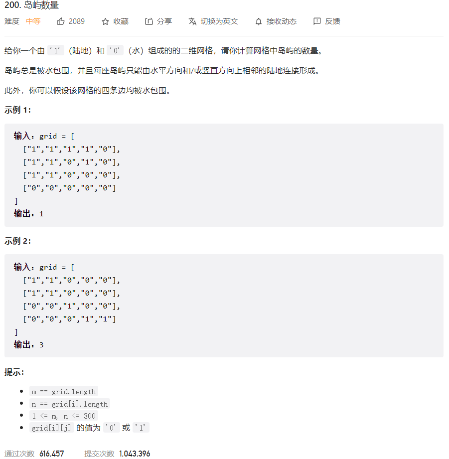



## 题目描述

> 🔥 [200. 岛屿数量](https://leetcode.cn/problems/number-of-islands/)



## 思路分析

> 感染

## 参考代码

```go
func numIslands(grid [][]byte) int {
	if len(grid) == 0 || len(grid[0]) == 0 {
		return 0
	}
	m, n := len(grid), len(grid[0])
	count := 0
	for i := 0; i < m; i++ {
		for j := 0; j < n; j++ {
			if grid[i][j] == '1' {
				count++
				dfs(grid, i, j)
			}
		}
	}
	return count
}

func dfs(grid [][]byte, i, j int) {
	if i < 0 || i >= len(grid) || j < 0 || j >= len(grid[0]) || grid[i][j] != '1' {
		return
	}
	grid[i][j] = 2
	dfs(grid, i-1, j)
	dfs(grid, i+1, j)
	dfs(grid, i, j-1)
	dfs(grid, i, j+1)
}
```

<a class="button show-hidden">🍏 点击查看 Java 题解</a>

```java
write your code here
```

## 相似题目

| 题目                                                         | 难度   | 题解 |
| ------------------------------------------------------------ | ------ | ---- |
| [被围绕的区域](https://leetcode.cn/problems/surrounded-regions/) | Medium |      |
| [墙与门](https://leetcode.cn/problems/walls-and-gates/) | Medium |      |
| [岛屿数量 II](https://leetcode.cn/problems/number-of-islands-ii/) | Hard |      |
| [无向图中连通分量的数目](https://leetcode.cn/problems/number-of-connected-components-in-an-undirected-graph/) | Medium |      |
| [不同岛屿的数量](https://leetcode.cn/problems/number-of-distinct-islands/) | Medium |      |
| [岛屿的最大面积](https://leetcode.cn/problems/max-area-of-island/) | Medium |      |
