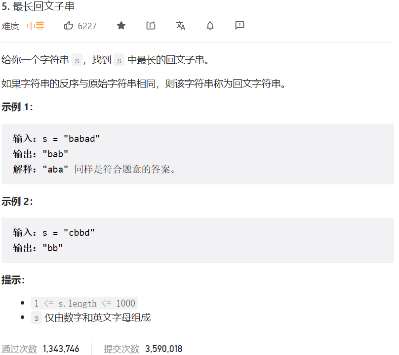



## 题目描述

> 🔥 [5. 最长回文子串](https://leetcode.cn/problems/longest-palindromic-substring/)



## 思路分析

> 中心扩散法

## 参考代码

```go
func longestPalindrome(s string) string {
	res := ""
	for i := 0; i < len(s); i++ {
		s1 := palindrome(s, i, i)
		s2 := palindrome(s, i, i+1)
		if len(s1) > len(res) {
			res = s1
		}
		if len(s2) > len(res) {
			res = s2
		}
	}
	return res
}

func palindrome(s string, i, j int) string {
	for i >= 0 && j < len(s) && s[i] == s[j] {
		i--
		j++
	}
	return s[i+1 : j]
}
```

<a class="button show-hidden">🍏 点击查看 Java 题解</a>

```java
class Solution {
    public String longestPalindrome(String s) {
        String res = "";
        for (int i = 0; i < s.length(); i++) {
            String s1 = palindrome(s, i, i);
            String s2 = palindrome(s, i, i + 1);
            if (s1.length() > res.length()) {
                res = s1;
            }
            if (s2.length() > res.length()) {
                res = s2;
            }
        }
        return res;
    }

    public String palindrome(String s, int i, int j) {
        while (i >= 0 && j < s.length() && s.charAt(i) == s.charAt(j)) {
            i--;
            j++;
        }
        return s.substring(i + 1, j);
    }
}
```

## 相似题目

| 题目                                                         | 难度   | 题解 |
| ------------------------------------------------------------ | ------ | ---- |
| [最短回文串](https://leetcode.cn/problems/shortest-palindrome/) | Hard |      |
| [回文排列](https://leetcode.cn/problems/palindrome-permutation/) | Easy |      |
| [回文对](https://leetcode.cn/problems/palindrome-pairs/) | Hard |      |
| [最长回文子序列](https://leetcode.cn/problems/longest-palindromic-subsequence/) | Medium |      |
| [回文子串](https://leetcode.cn/problems/palindromic-substrings/) | Medium |      |
