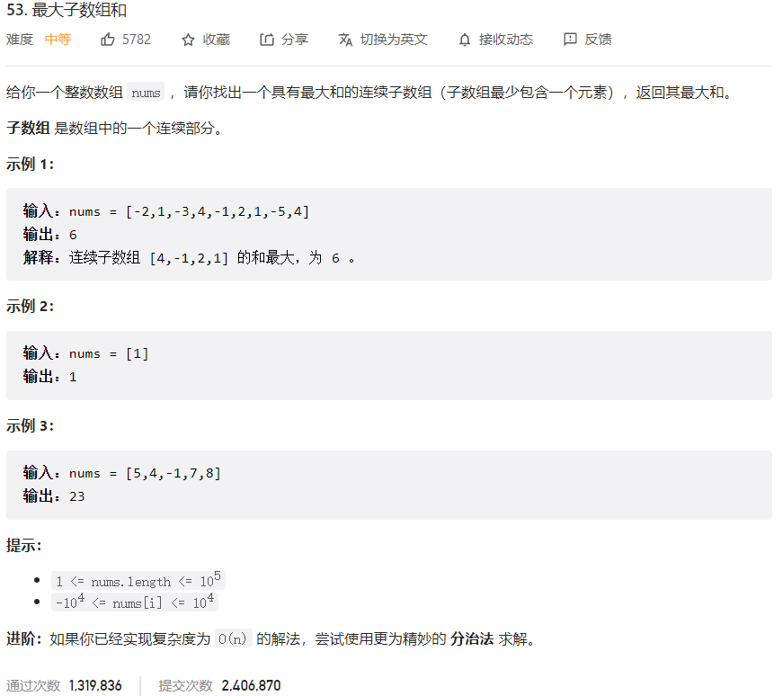



## 题目描述

> 🔥 [53. 最大子数组和](https://leetcode.cn/problems/maximum-subarray/)



## 思路分析

> 思路描述

## 参考代码

```go
func maxSubArray(nums []int) int {
	res, total := nums[0], nums[0]
	for i := 1; i < len(nums); i++ {
		if total > 0 {
			total += nums[i]
		} else {
			total = nums[i]
		}
		res = max(res, total)
	}
	return res
}

func max(a, b int) int {
	if a > b {
		return a
	}
	return b
}
```

<a class="button show-hidden">🍏 点击查看 Java 题解</a>

```java
write your code here
```

## 相似题目

| 题目                                                         | 难度   | 题解 |
| ------------------------------------------------------------ | ------ | ---- |
| [买卖股票的最佳时机](https://leetcode.cn/problems/best-time-to-buy-and-sell-stock/) | Easy |      |
| [乘积最大子数组](https://leetcode.cn/problems/maximum-product-subarray/) | Medium |      |
| [数组的度](https://leetcode.cn/problems/degree-of-an-array/) | Easy |      |
| [最长湍流子数组](https://leetcode.cn/problems/longest-turbulent-subarray/) | Medium |      |
