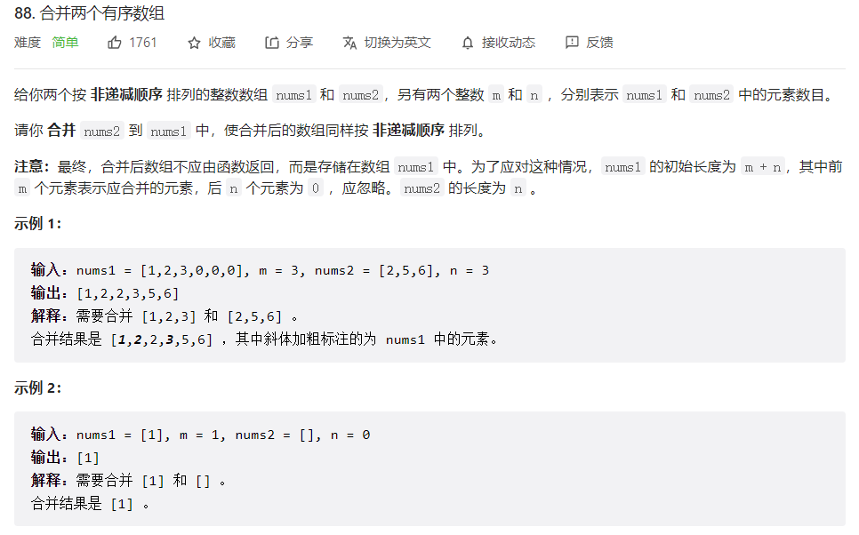
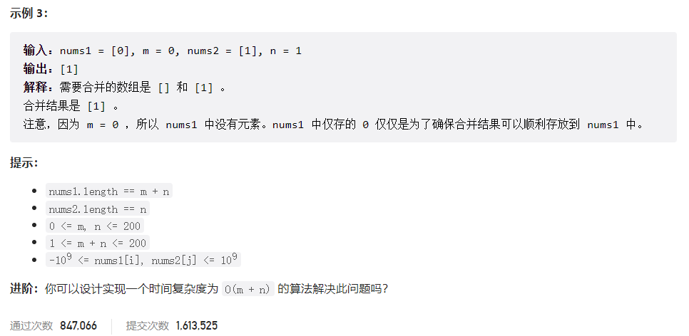



## 题目描述

> 🔥 [88. 合并两个有序数组](https://leetcode.cn/problems/merge-sorted-array/)





## 思路分析

> **双指针法：从后往前遍历两个数组，将较大的数放到 nums1 的末尾，直到遍历完 nums2。**
>
> 1. 初始化两个指针 p1 和 p2，分别指向 nums1 和 nums2 的末尾，以及一个指针 p 指向 nums1 的最后一个元素。
>2. 比较 nums1[p1] 和 nums2[p2] 的大小，将较大的数放到 nums1[p] 的位置，然后将对应的指针向前移动一位。
> 3. 当 p2 >= 0 时，说明 nums2 中还有元素没有遍历完，将 nums2 中剩余的元素依次放入 nums1 中。

## 参考代码

```go
func merge(nums1 []int, m int, nums2 []int, n int) {
	p, p1, p2 := m+n-1, m-1, n-1
	for p1 >= 0 && p2 >= 0 {
		if nums1[p1] > nums2[p2] {
			nums1[p] = nums1[p1]
			p1--
		} else {
			nums1[p] = nums2[p2]
			p2--
		}
		p--
	}
	for p2 >= 0 {
		nums1[p] = nums2[p2]
		p2--
		p--
	}
}
```

<a class="button show-hidden">🍏 点击查看 Java 题解</a>

```java
class Solution {
    public void merge(int[] nums1, int m, int[] nums2, int n) {
        int p1 = m - 1, p2 = n - 1, p = m + n - 1;
        while (p1 >= 0 && p2 >= 0) {
            if (nums1[p1] > nums2[p2]) {
                nums1[p] = nums1[p1];
                p1--;
            } else {
                nums1[p] = nums2[p2];
                p2--;
            }
            p--;
        }
        while (p2 >= 0) {
            nums1[p] = nums2[p2];
            p2--;
            p--;
        }
    }
}
```

## 相似题目

| 题目                                                         | 难度   | 题解 |
| ------------------------------------------------------------ | ------ | ---- |
| [合并两个有序链表](https://leetcode.cn/problems/merge-two-sorted-lists/) | Easy |      |
| [有序数组的平方](https://leetcode.cn/problems/squares-of-a-sorted-array/) | Easy |      |
| [区间列表的交集](https://leetcode.cn/problems/interval-list-intersections/) | Medium |      |
