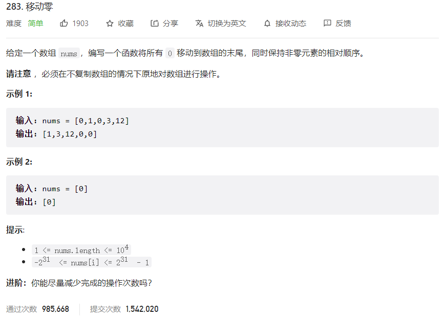



## 题目描述

> 🔥 [283. 移动零](https://leetcode.cn/problems/move-zeroes/)



## 思路分析

> 双指针

## 参考代码

```go
func moveZeroes(nums []int) {
	index := 0
	for i := 0; i < len(nums); i++ {
		if nums[i] != 0 {
			nums[index] = nums[i]
			index++
		}
	}
	for i := index; i < len(nums); i++ {
		nums[i] = 0
	}
}
```

<a class="button show-hidden">🍏 点击查看 Java 题解</a>

```java
write your code here
```

## 相似题目

| 题目                                                         | 难度   | 题解 |
| ------------------------------------------------------------ | ------ | ---- |
| [移除元素](https://leetcode.cn/problems/remove-element/) | Easy |      |
