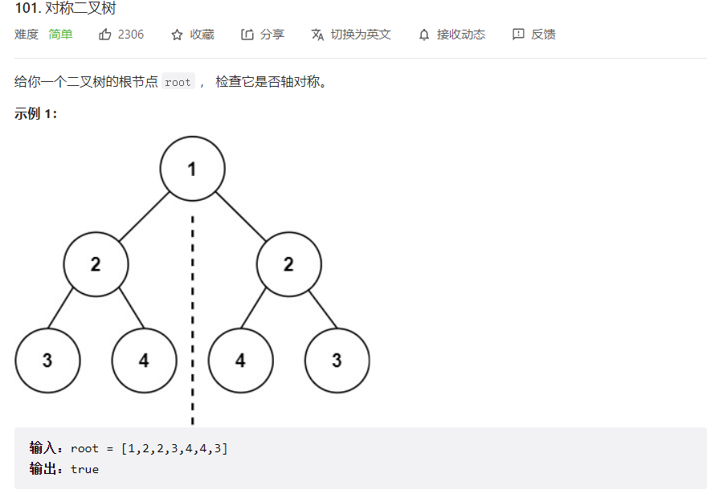
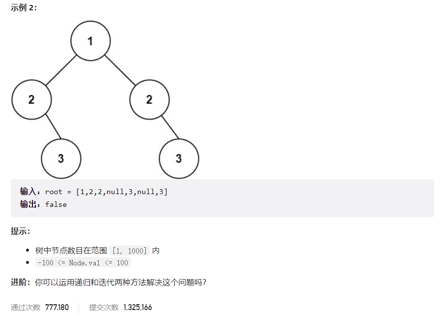



## 题目描述

> 🔥 [101. 对称二叉树](https://leetcode.cn/problems/symmetric-tree/)





## 思路分析

> 递归

## 参考代码

```go
func isSymmetric(root *TreeNode) bool {
	if root == nil {
		return true
	}
	return isMirror(root.Left, root.Right)
}

func isMirror(left *TreeNode, right *TreeNode) bool {
	if left == nil && right == nil {
		return true
	}
	if left == nil || right == nil {
		return false
	}
	return left.Val == right.Val && isMirror(left.Left, right.Right) && isMirror(left.Right, right.Left)
}
```

<a class="button show-hidden">🍏 点击查看 Java 题解</a>

```java
class Solution {
    public boolean isSymmetric(TreeNode root) {
        if (root == null) {
            return true;
        }
        return isMirror(root.left, root.right);
    }

    public boolean isMirror(TreeNode left, TreeNode right) {
        if (left == null && right == null) {
            return true;
        } else if (left == null || right == null) {
            return false;
        }
        if (left.val != right.val) {
            return false;
        }
        return isMirror(left.left, right.right) && isMirror(left.right, right.left);
    }
}
```
