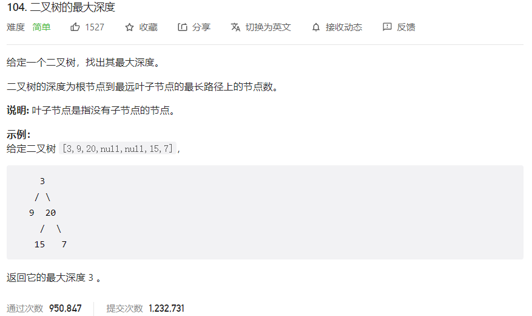



## 题目描述

> 🔥 [104. 二叉树的最大深度](https://leetcode.cn/problems/maximum-depth-of-binary-tree/)



## 思路分析

> 层序遍历
>

## 参考代码

```go
func maxDepth(root *TreeNode) int {
	if root == nil {
		return 0
	}
	leftDepth := maxDepth(root.Left)
	rightDepth := maxDepth(root.Right)
	return max(leftDepth, rightDepth) + 1
}

func max(a, b int) int {
	if a > b {
		return a
	}
	return b
}
```

```go
func maxDepth(root *TreeNode) int {
	if root == nil {
		return 0
	}
	depth := 0
	queue := []*TreeNode{root}
	for len(queue) > 0 {
		size := len(queue)
		depth++
		for i := 0; i < size; i++ {
			node := queue[0]
			queue = queue[1:]
			if node.Left != nil {
				queue = append(queue, node.Left)
			}
			if node.Right != nil {
				queue = append(queue, node.Right)
			}
		}
	}
	return depth
}
```

```go
func maxDepth(root *TreeNode) int {
	if root == nil {
		return 0
	}
	var depth int
	queue := []*TreeNode{root}
	for len(queue) > 0 {
		levelSize := len(queue)
		for i := 0; i < levelSize; i++ {
			node := queue[i]
			if node.Left != nil {
				queue = append(queue, node.Left)
			}
			if node.Right != nil {
				queue = append(queue, node.Right)
			}
		}
		queue = queue[levelSize:]
		depth++
	}
	return depth
}
```

<a class="button show-hidden">🍏 点击查看 Java 题解</a>

```java
write your code here
```

## 相似题目

| 题目                                                         | 难度   | 题解 |
| ------------------------------------------------------------ | ------ | ---- |
| [平衡二叉树](https://leetcode.cn/problems/balanced-binary-tree/) | Easy |      |
| [二叉树的最小深度](https://leetcode.cn/problems/minimum-depth-of-binary-tree/) | Easy |      |
| [N 叉树的最大深度](https://leetcode.cn/problems/maximum-depth-of-n-ary-tree/) | Easy |      |
