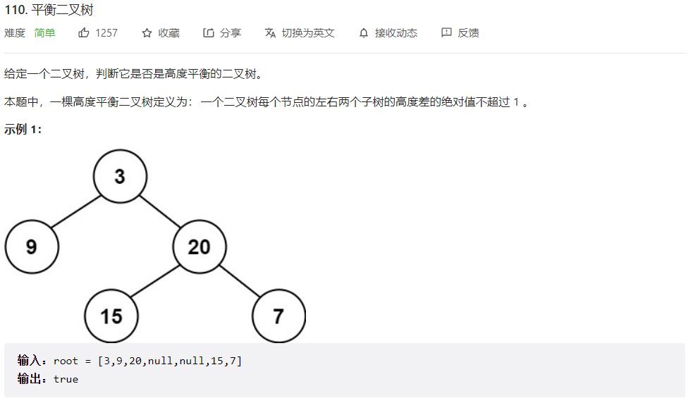
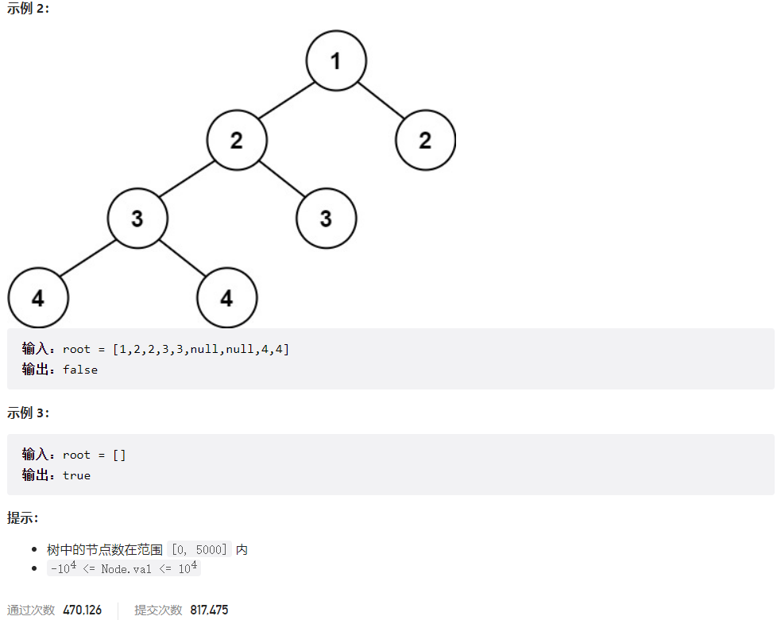



## 题目描述

> 🔥 [110. 平衡二叉树](https://leetcode.cn/problems/balanced-binary-tree/)





## 思路分析

> 思路描述

## 参考代码

```go
func isBalanced(root *TreeNode) bool {
	if root == nil {
		return true
	}
	left, right := depth(root.Left), depth(root.Right)
	if abs(left, right) > 1 {
		return false
	}
	return isBalanced(root.Left) && isBalanced(root.Right)
}

func depth(root *TreeNode) int {
	if root == nil {
		return 0
	}
	return max(depth(root.Left), depth(root.Right)) + 1
}

func max(a, b int) int {
	if a > b {
		return a
	}
	return b
}

func abs(a, b int) int {
	if a > b {
		return a - b
	}
	return b - a
}
```

<a class="button show-hidden">🍏 点击查看 Java 题解</a>

```java
class Solution {
    public boolean isBalanced(TreeNode root) {
        if (root == null) {
            return true;
        }
        if (Math.abs(depth(root.left) - depth(root.right)) > 1) {
            return false;
        }
        return isBalanced(root.left) && isBalanced(root.right);
    }

    public int depth(TreeNode root) {
        if (root == null) {
            return 0;
        }
        return Math.max(depth(root.left), depth(root.right)) + 1;
    }
}
```

## 相似题目

| 题目                                                         | 难度   | 题解 |
| ------------------------------------------------------------ | ------ | ---- |
| [二叉树的最大深度](https://leetcode.cn/problems/maximum-depth-of-binary-tree/) | Easy |      |
