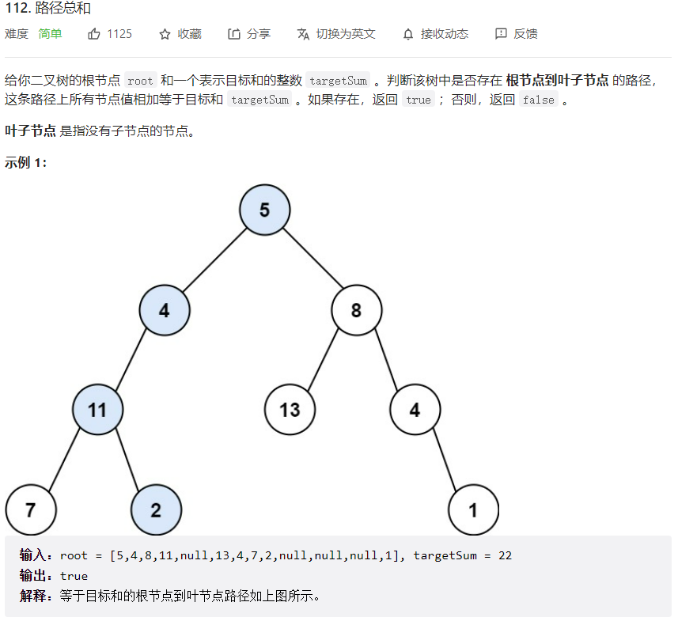
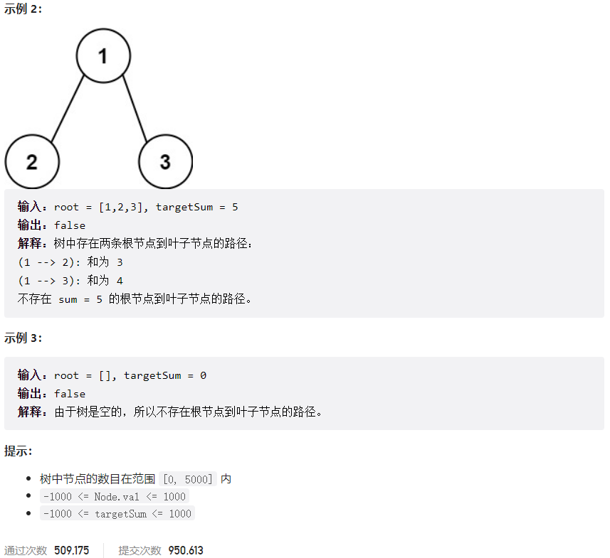



## 题目描述

> 🔥 [112. 路径总和](https://leetcode.cn/problems/path-sum/)





## 思路分析

> 思路描述

## 参考代码

```go
func hasPathSum(root *TreeNode, targetSum int) bool {
	if root == nil {
		return false
	}
	if root.Left == nil && root.Right == nil && targetSum == root.Val {
		return true
	}
	return hasPathSum(root.Left, targetSum-root.Val) || hasPathSum(root.Right, targetSum-root.Val)
}
```

```go
func hasPathSum(root *TreeNode, targetSum int) bool {
	if root == nil {
		return false
	}
	queue := []*TreeNode{root}
	for len(queue) > 0 {
		size := len(queue)
		for i := 0; i < size; i++ {
			node := queue[i]
			if node.Left == nil && node.Right == nil && node.Val == targetSum {
				return true
			}
			if node.Left != nil {
				node.Left.Val += node.Val
				queue = append(queue, node.Left)
			}
			if node.Right != nil {
				node.Right.Val += node.Val
				queue = append(queue, node.Right)
			}
		}
		queue = queue[size:]
	}
	return false
}
```

<a class="button show-hidden">🍏 点击查看 Java 题解</a>

```java
write your code here
```

## 相似题目

| 题目                                                                       | 难度     | 题解 |
|--------------------------------------------------------------------------|--------|----|
| [路径总和 II](https://leetcode.cn/problems/path-sum-ii/)                     | Medium |    |
| [二叉树中的最大路径和](https://leetcode.cn/problems/binary-tree-maximum-path-sum/) | Hard   |    |
| [求根节点到叶节点数字之和](https://leetcode.cn/problems/sum-root-to-leaf-numbers/)   | Medium |    |
| [路径总和 III](https://leetcode.cn/problems/path-sum-iii/)                   | Medium |    |
| [路径总和 IV](https://leetcode.cn/problems/path-sum-iv/)                     | Medium |    |
