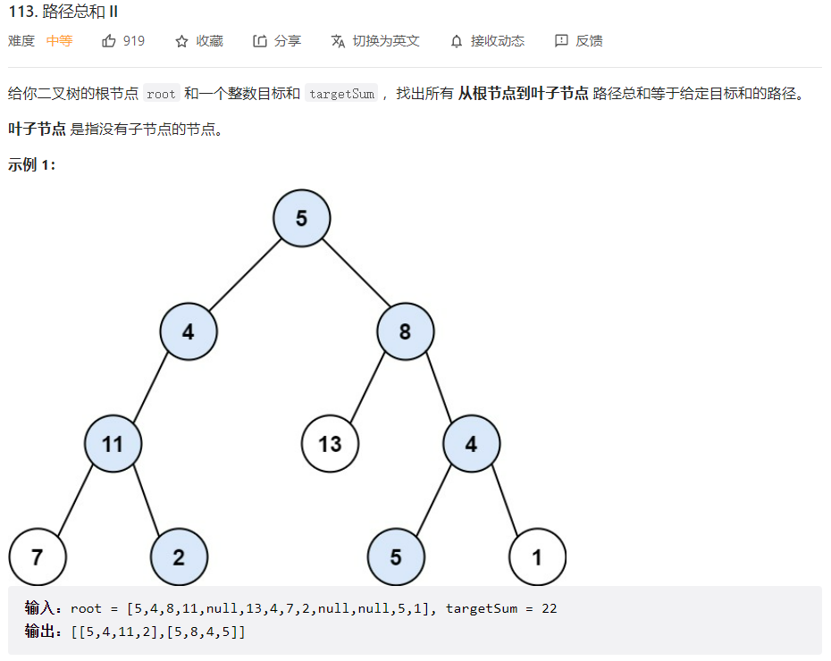
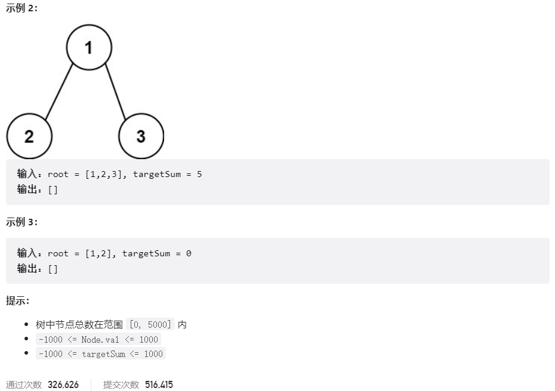



## 题目描述

> 🔥 [113. 路径总和 II](https://leetcode.cn/problems/path-sum-ii/)





## 思路分析

> 思路描述

## 参考代码

```go
func pathSum(root *TreeNode, targetSum int) [][]int {
	res := make([][]int, 0)
	if root == nil {
		return res
	}
	dfs(root, targetSum, []int{root.Val}, &res)
	return res
}

func dfs(node *TreeNode, pathSum int, path []int, res *[][]int) {
	if node.Left == nil && node.Right == nil && pathSum == node.Val {
		// 创建一个新的路径副本，以避免修改原始路径
		tempPath := make([]int, len(path))
		copy(tempPath, path)
		*res = append(*res, tempPath)
	}
	if node.Left != nil {
		newPath := append(path, node.Left.Val) // 创建新的路径副本
		dfs(node.Left, pathSum-node.Val, newPath, res)
	}
	if node.Right != nil {
		newPath := append(path, node.Right.Val) // 创建新的路径副本
		dfs(node.Right, pathSum-node.Val, newPath, res)
	}
}
```

```go
type QueueNode struct {
	Node *TreeNode
	Sum  int
	Path []int
}

func pathSum(root *TreeNode, targetSum int) [][]int {
	res := make([][]int, 0)
	if root == nil {
		return res
	}
	queue := []*QueueNode{&QueueNode{
		Node: root,
		Sum:  root.Val,
		Path: []int{root.Val},
	}}
	for len(queue) > 0 {
		node, sum, path := queue[0].Node, queue[0].Sum, queue[0].Path
		queue = queue[1:]
		if node.Left == nil && node.Right == nil && sum == targetSum {
			tempPath := make([]int, len(path))
			copy(tempPath, path)
			res = append(res, tempPath)
		}
		if node.Left != nil {
			newPath := make([]int, len(path))
			copy(newPath, path)
			newPath = append(newPath, node.Left.Val)
			queue = append(queue, &QueueNode{
				Node: node.Left,
				Sum:  sum + node.Left.Val,
				Path: newPath,
			})
		}
		if node.Right != nil {
			newPath := make([]int, len(path))
			copy(newPath, path)
			newPath = append(newPath, node.Right.Val)
			queue = append(queue, &QueueNode{
				Node: node.Right,
				Sum:  sum + node.Right.Val,
				Path: newPath,
			})
		}
	}
	return res
}
```

<a class="button show-hidden">🍏 点击查看 Java 题解</a>

```java
write your code here
```

## 相似题目

| 题目                                                         | 难度   | 题解 |
| ------------------------------------------------------------ | ------ | ---- |
| [路径总和](https://leetcode.cn/problems/path-sum/)           | Easy   |      |
| [二叉树的所有路径](https://leetcode.cn/problems/binary-tree-paths/) | Easy   |      |
| [路径总和 III](https://leetcode.cn/problems/path-sum-iii/)   | Medium |      |
| [路径总和 IV](https://leetcode.cn/problems/path-sum-iv/)     | Medium |      |
