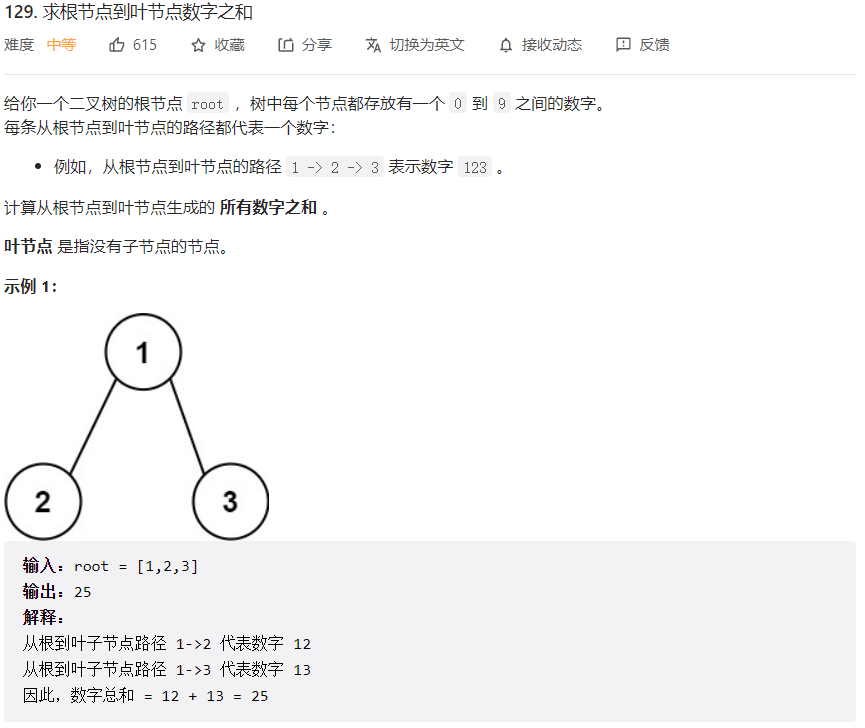
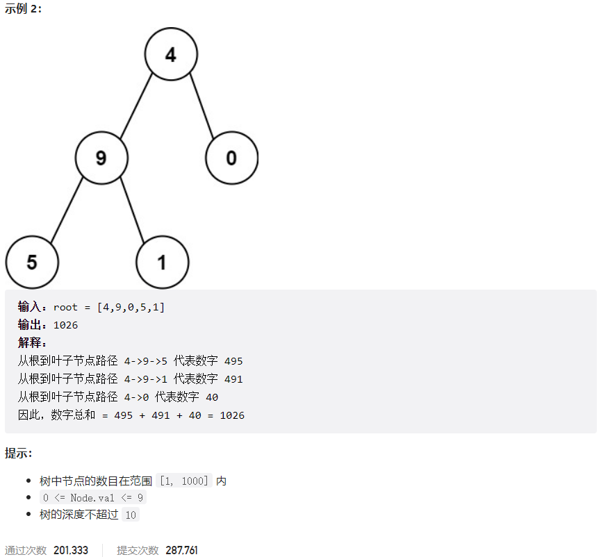



## 题目描述

> 🔥 [129. 求根节点到叶节点数字之和](https://leetcode.cn/problems/sum-root-to-leaf-numbers/)





## 思路分析

> dfs
>
> bfs

## 参考代码

```go
write your code here
```

<a class="button show-hidden">🍏 点击查看 Java 题解</a>

```java
write your code here
```

## 相似题目

| 题目                                                         | 难度   | 题解 |
| ------------------------------------------------------------ | ------ | ---- |
| [路径总和](https://leetcode.cn/problems/path-sum/) | Easy |      |
| [二叉树中的最大路径和](https://leetcode.cn/problems/binary-tree-maximum-path-sum/) | Hard |      |
| [从叶结点开始的最小字符串](https://leetcode.cn/problems/smallest-string-starting-from-leaf/) | Medium |      |
