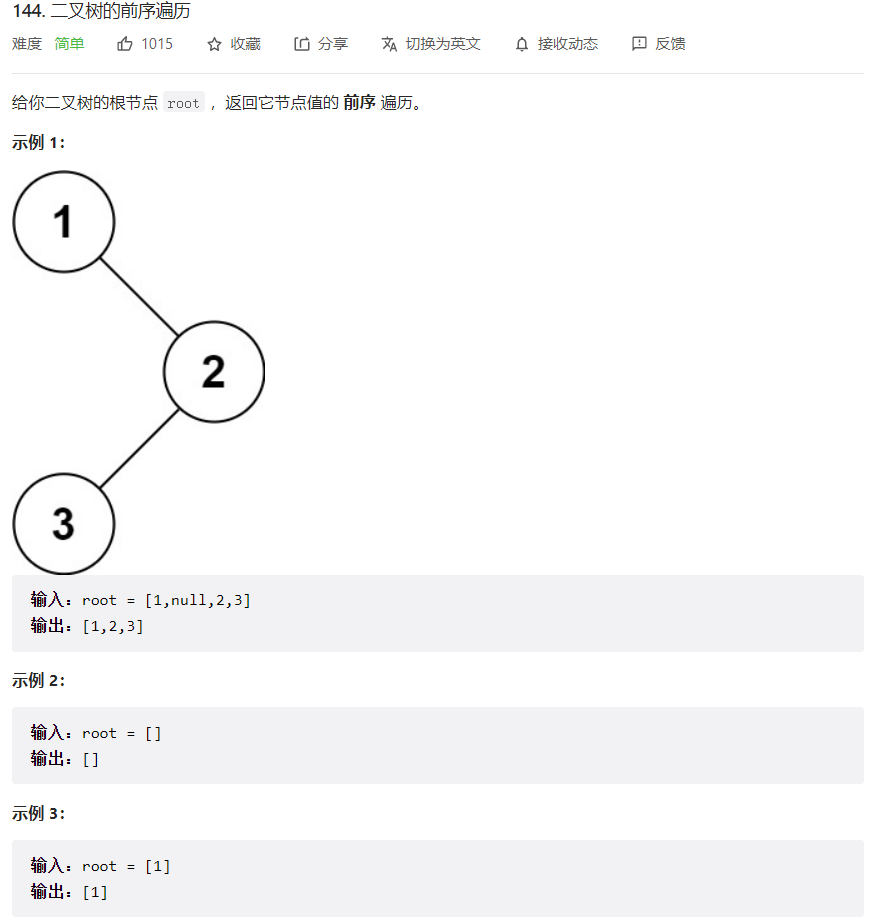
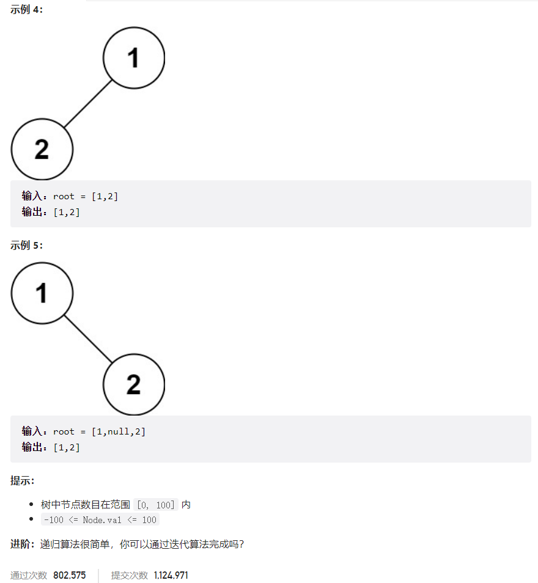



## 题目描述

> 🔥 [144. 二叉树的前序遍历](https://leetcode.cn/problems/binary-tree-preorder-traversal/)





## 思路分析

> 二叉树前序遍历使用栈

## 参考代码

```go
func preorderTraversal(root *TreeNode) []int {
	if root == nil {
		return nil
	}
	var res []int
	stack := []*TreeNode{root}
	for len(stack) > 0 {
		node := stack[len(stack)-1]
		stack = stack[:len(stack)-1]
		res = append(res, node.Val)
		// 注意这里先将右子节点入栈，再将左子节点入栈
		if node.Right != nil {
			stack = append(stack, node.Right)
		}
		if node.Left != nil {
			stack = append(stack, node.Left)
		}
	}
	return res
}
```

<a class="button show-hidden">🍏 点击查看 Java 题解</a>

```java
write your code here
```

## 相似题目

| 题目                                                         | 难度   | 题解 |
| ------------------------------------------------------------ | ------ | ---- |
| [二叉树的中序遍历](https://leetcode.cn/problems/binary-tree-inorder-traversal/) | Easy |      |
| [验证前序遍历序列二叉搜索树](https://leetcode.cn/problems/verify-preorder-sequence-in-binary-search-tree/) | Medium |      |
| [N 叉树的前序遍历](https://leetcode.cn/problems/n-ary-tree-preorder-traversal/) | Easy |      |
