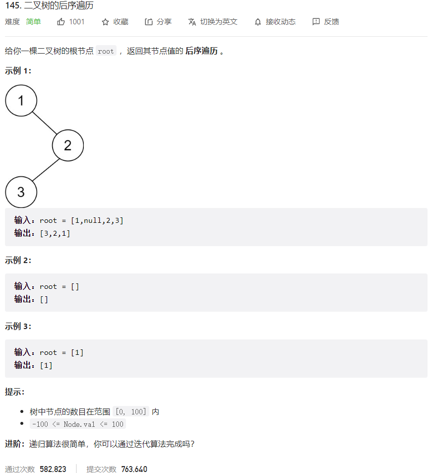



## 题目描述

> 🔥 [145. 二叉树的后序遍历](https://leetcode.cn/problems/binary-tree-postorder-traversal/)



## 思路分析

> 递归

## 参考代码

```go
write your code here
```

<a class="button show-hidden">🍏 点击查看 Java 题解</a>

```java
write your code here
```

## 相似题目

| 题目                                                         | 难度   | 题解 |
| ------------------------------------------------------------ | ------ | ---- |
| [二叉树的中序遍历](https://leetcode.cn/problems/binary-tree-inorder-traversal/) | Easy |      |
| [N 叉树的后序遍历](https://leetcode.cn/problems/n-ary-tree-postorder-traversal/) | Easy |      |
