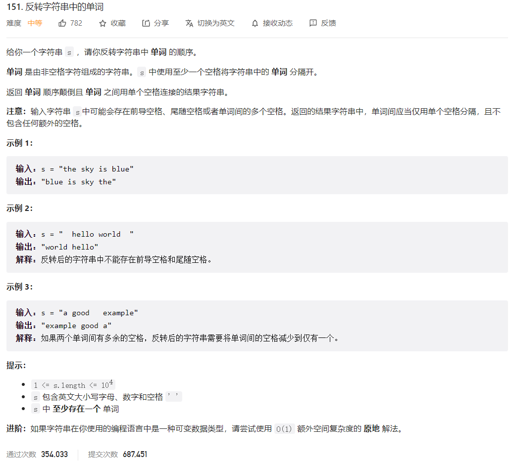



## 题目描述

> 🔥 [151. 反转字符串中的单词](https://leetcode.cn/problems/reverse-words-in-a-string/)



## 思路分析

> 双指针

## 参考代码

```go
func reverseWords(s string) string {
	fields := strings.Fields(s)
	i, j := 0, len(fields)-1
	for i < j {
		fields[i], fields[j] = fields[j], fields[i]
		i++
		j--
	}
	return strings.Join(fields, " ")
}
```

```go
func reverseWords(s string) string {
	fields := strings.Fields(s)
	reverse(fields)
	return strings.Join(fields, " ")
}

func reverse(slice []string) {
	for i, j := 0, len(slice)-1; i < j; i, j = i+1, j-1 {
		slice[i], slice[j] = slice[j], slice[i]
	}
}
```

```go
func reverseWords(s string) string {
	fields := strings.Fields(s)
	for i, j := 0, len(fields)-1; i < j; i, j = i+1, j+1 {
		fields[i], fields[j] = fields[j], fields[i]
	}
	return strings.Join(fields, " ")
}
```

<a class="button show-hidden">🍏 点击查看 Java 题解</a>

```java
class Solution {
    public String reverseWords(String s) {
        String[] words = s.trim().split("\\s+");
        int left = 0;
        int right = words.length - 1;
        while (left < right) {
            String temp = words[left];
            words[left] = words[right];
            words[right] = temp;
            left++;
            right--;
        }
        return String.join(" ", words);
    }
}
```

## 相似题目

| 题目                                                         | 难度   | 题解 |
| ------------------------------------------------------------ | ------ | ---- |
| [反转字符串中的单词 II](https://leetcode.cn/problems/reverse-words-in-a-string-ii/) | Medium |      |
