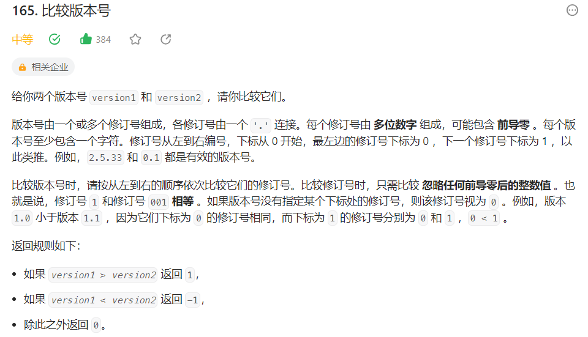
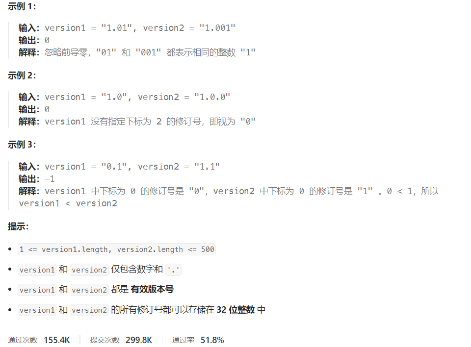



## 题目描述

> 🔥 [165. 比较版本号](https://leetcode.cn/problems/compare-version-numbers/)





## 思路分析

> 思路描述

## 参考代码

```go
func compareVersion(version1 string, version2 string) int {
	s1 := strings.Split(version1, ".")
	s2 := strings.Split(version2, ".")
	p1, p2 := 0, 0
	for p1 < len(s1) || p2 < len(s2) {
		v1, v2 := 0, 0
		if p1 < len(s1) {
			v1, _ = strconv.Atoi(s1[p1])
			p1++
		}
		if p2 < len(s2) {
			v2, _ = strconv.Atoi(s2[p2])
			p2++
		}
		if v1 > v2 {
			return 1
		} else if v1 < v2 {
			return -1
		}
	}
	return 0
}
```

<a class="button show-hidden">🍏 点击查看 Java 题解</a>

```java
class Solution {
    public int compareVersion(String version1, String version2) {
        String[] nums1 = version1.split("\\.");
        String[] nums2 = version2.split("\\.");
        int i = 0, j = 0;
        while (i < nums1.length || j < nums2.length) {
            int v1 = 0, v2 = 0;
            if (i < nums1.length) {
                v1 = Integer.parseInt(nums1[i]);
                i++;
            }
            if (j < nums2.length) {
                v2 = Integer.parseInt(nums2[j]);
                j++;
            }
            if (v1 > v2) {
                return 1;
            } else if (v1 < v2) {
                return -1;
            }
        }
        return 0;
    }
}
```
