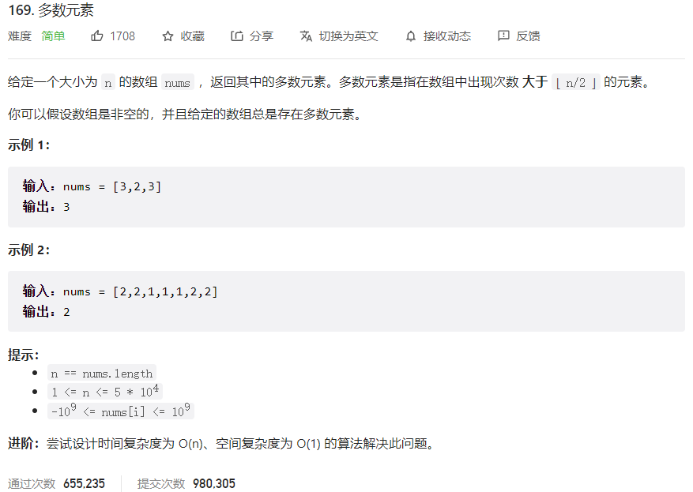



## 题目描述

> 🔥 [169. 多数元素](https://leetcode.cn/problems/majority-element/)



## 思路分析

> 摩尔投票法

## 参考代码

```go
func majorityElement(nums []int) int {
	candidate, count := nums[0], 1
	for i := 1; i < len(nums); i++ {
		if nums[i] == candidate {
			count++
		} else {
			count--
			if count == 0 {
				candidate = nums[i]
				count = 1
			}
		}
	}
	return candidate
}
```

<a class="button show-hidden">🍏 点击查看 Java 题解</a>

```java
write your code here
```

## 相似题目

| 题目                                                         | 难度   | 题解 |
| ------------------------------------------------------------ | ------ | ---- |
| [多数元素 II](https://leetcode.cn/problems/majority-element-ii/) | Medium |      |
| [检查一个数是否在数组中占绝大多数](https://leetcode.cn/problems/check-if-a-number-is-majority-element-in-a-sorted-array/) | Easy |      |
