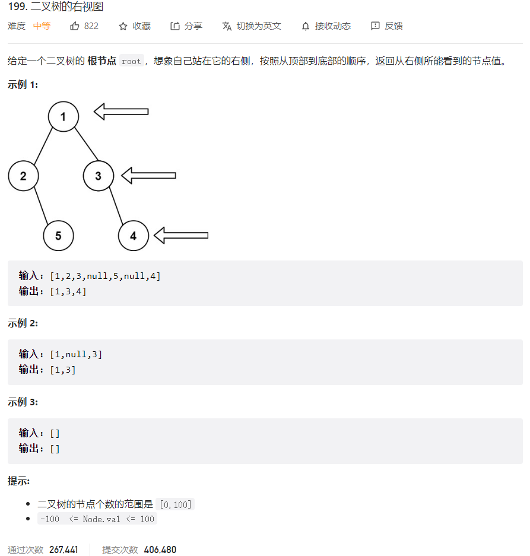



## 题目描述

> 🔥 [199. 二叉树的右视图](https://leetcode.cn/problems/binary-tree-right-side-view/)



## 思路分析

> 层序遍历

## 参考代码

```go
func rightSideView(root *TreeNode) []int {
	res := make([]int, 0)
	if root == nil {
		return res
	}
	queue := []*TreeNode{root}
	for len(queue) > 0 {
		size := len(queue)
		for i := 0; i < size; i++ {
			node := queue[0]
			if i == size-1 {
				res = append(res, node.Val)
			}
			queue = queue[1:]
			if node.Left != nil {
				queue = append(queue, node.Left)
			}
			if node.Right != nil {
				queue = append(queue, node.Right)
			}
		}
	}
	return res
}
```

```go
func rightSideView(root *TreeNode) []int {
	var res []int
	if root == nil {
		return res
	}
	queue := []*TreeNode{root}
	for len(queue) > 0 {
		size := len(queue)
		for i := 0; i < size; i++ {
			node := queue[i]
			if i == size-1 {
				res = append(res, node.Val)
			}
			if node.Left != nil {
				queue = append(queue, node.Left)
			}
			if node.Right != nil {
				queue = append(queue, node.Right)
			}
		}
		queue = queue[size:]
	}
	return res
}
```

<a class="button show-hidden">🍏 点击查看 Java 题解</a>

```java
class Solution {
    public List<Integer> rightSideView(TreeNode root) {
        List<Integer> res = new ArrayList<>();
        if (root == null) {
            return res;
        }
        Queue<TreeNode> queue = new LinkedList<>();
        queue.offer(root);
        while (!queue.isEmpty()) {
            int size = queue.size();
            for (int i = 0; i < size; i++) {
                TreeNode node = queue.poll();
                if (i == size - 1) {
                    res.add(node.val);
                }
                if (node.left != null) {
                    queue.offer(node.left);
                }
                if (node.right != null) {
                    queue.offer(node.right);
                }
            }
        }
        return res;
    }
}
```

## 相似题目

| 题目                                                         | 难度   | 题解 |
| ------------------------------------------------------------ | ------ | ---- |
| [填充每个节点的下一个右侧节点指针](https://leetcode.cn/problems/populating-next-right-pointers-in-each-node/) | Medium |      |
| [二叉树的边界](https://leetcode.cn/problems/boundary-of-binary-tree/) | Medium |      |
