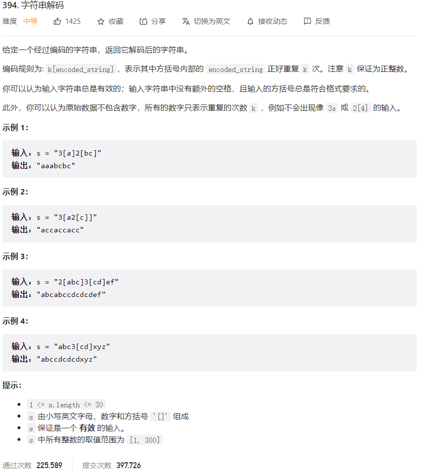



## 题目描述

> 🔥 [394. 字符串解码](https://leetcode.cn/problems/decode-string/)



## 思路分析

> 栈

## 参考代码

```go
func decodeString(s string) string {
	numStack := make([]int, 0)
	strStack := make([]string, 0)
	curStr, num := "", 0
	for i := 0; i < len(s); i++ {
		c := s[i]
		if c >= '0' && c <= '9' {
			num = num*10 + int(c-'0')
		} else if c == '[' {
			numStack = append(numStack, num)
			strStack = append(strStack, curStr)
			curStr, num = "", 0
		} else if c == ']' {
			count := numStack[len(numStack)-1]
			numStack = numStack[:len(numStack)-1]

			preStr := strStack[len(strStack)-1]
			strStack = strStack[:len(strStack)-1]

			curStr = preStr + strings.Repeat(curStr, count)
		} else {
			curStr += string(c)
		}
	}
	return curStr
}
```

<a class="button show-hidden">🍏 点击查看 Java 题解</a>

```java
write your code here
```

## 相似题目

| 题目                                                         | 难度   | 题解 |
| ------------------------------------------------------------ | ------ | ---- |
| [编码最短长度的字符串](https://leetcode.cn/problems/encode-string-with-shortest-length/) | Hard |      |
| [原子的数量](https://leetcode.cn/problems/number-of-atoms/) | Hard |      |
| [花括号展开](https://leetcode.cn/problems/brace-expansion/) | Medium |      |
