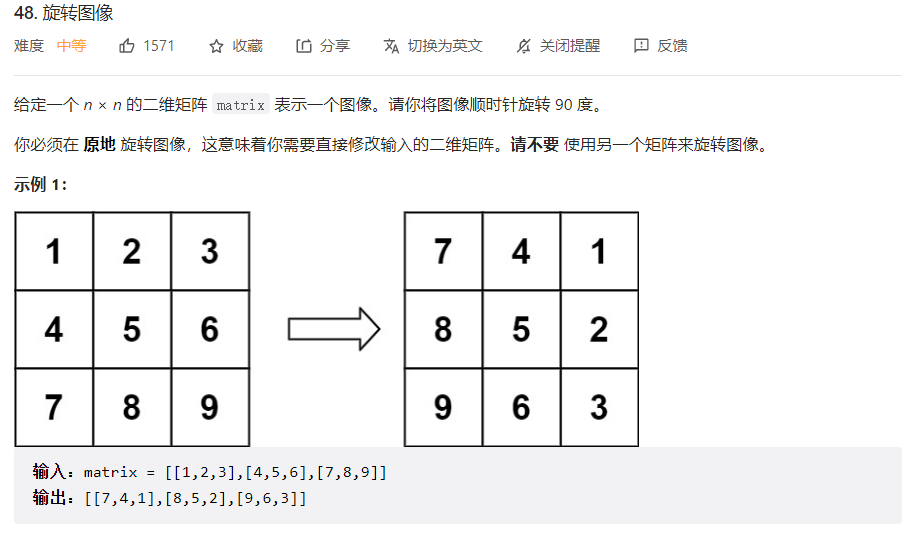
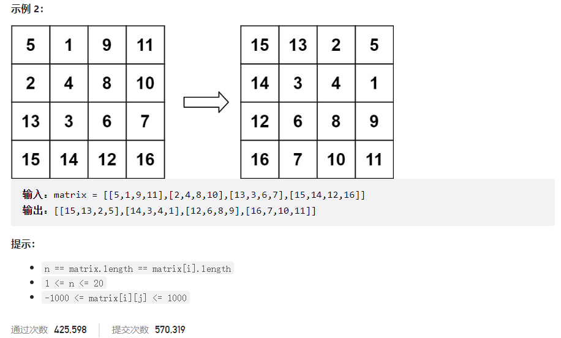



## 题目描述

> 🔥 [48. 旋转图像](https://leetcode.cn/problems/rotate-image/)





## 思路分析

> 首先沿着**对角线**翻转，然后**垂直**翻转。

## 参考代码

```go
func rotate(matrix [][]int) {
	n := len(matrix)
	// 先进行矩阵的转置
	for i := 0; i < n; i++ {
		for j := i; j < n; j++ {
			matrix[i][j], matrix[j][i] = matrix[j][i], matrix[i][j]
		}
	}
	// 再按中轴进行翻转
	for i := 0; i < n; i++ {
		for j := 0; j < n/2; j++ {
			matrix[i][j], matrix[i][n-j-1] = matrix[i][n-j-1], matrix[i][j]
		}
	}
}
```

<a class="button show-hidden">🍏 点击查看 Java 题解</a>

```java
write your code here
```
