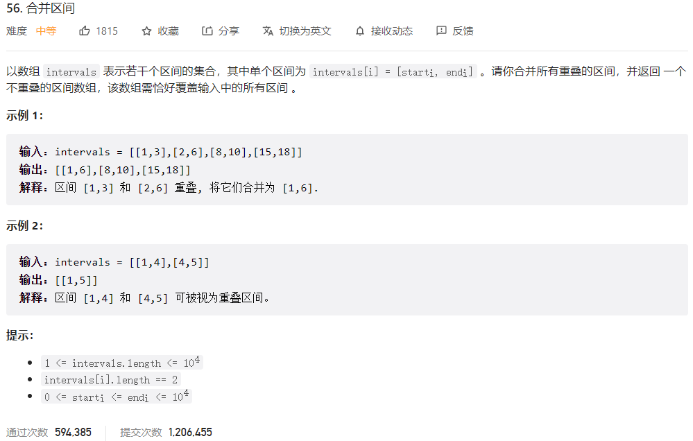



## 题目描述

> 🔥 [56. 合并区间](https://leetcode.cn/problems/merge-intervals/)



## 思路分析

> **解题思路：**
>
> 1. 首先，对区间按照起始位置进行排序，这样可以将重叠的区间排列在一起。
> 2. 遍历排序后的区间列表，用一个新的列表来存储合并后的区间。初始时，将第一个区间加入新列表。
> 3. 对于每个区间，判断其与新列表中最后一个区间是否重叠。如果重叠，更新新列表中最后一个区间的结束位置为当前区间的结束位置和原最后区间结束位置的较大值。如果不重叠，将当前区间加入新列表。
> 4. 最后返回新列表，其中包含合并后的区间。

## 参考代码

```go
func merge(intervals [][]int) [][]int {
	if len(intervals) == 0 {
		return [][]int{}
	}
	sort.SliceStable(intervals, func(i, j int) bool {
		return intervals[i][0] < intervals[j][0]
	})
	res := [][]int{intervals[0]}
	for i := 1; i < len(intervals); i++ {
		cur := intervals[i]
		if cur[0] <= res[len(res)-1][1] {
			res[len(res)-1][1] = max(res[len(res)-1][1], cur[1])
		} else {
			res = append(res, cur)
		}
	}
	return res
}

func max(a, b int) int {
	if a > b {
		return a
	}
	return b
}
```

```go
func merge(intervals [][]int) [][]int {
	res := make([][]int, 0)
	sort.Slice(intervals, func(i, j int) bool {
		return intervals[i][0] < intervals[j][0]
	})
	pre := intervals[0]
	for i := 1; i < len(intervals); i++ {
		cur := intervals[i]
		if pre[1] < cur[0] {
			res = append(res, pre)
			pre = cur
		} else {
			pre[1] = max(pre[1], cur[1])
		}
	}
	res = append(res, pre)
	return res
}

func max(a, b int) int {
	if a > b {
		return a
	}
	return b
}
```

<a class="button show-hidden">🍏 点击查看 Java 题解</a>

```java
class Solution {
    public int[][] merge(int[][] intervals) {
        List<int[]> res = new ArrayList<>();
        int n = intervals.length;
        Arrays.sort(intervals, Comparator.comparingInt(o -> o[0]));
        int[] pre = intervals[0];
        for (int i = 1; i < n; i++) {
            int[] cur = intervals[i];
            if (pre[1] < cur[0]) {
                res.add(pre);
                pre = cur;
            } else {
                pre[1] = Math.max(pre[1], cur[1]);
            }
        }
        res.add(pre);
        return res.toArray(new int[res.size()][]);
    }
}
```

## 相似题目

| 题目                                                         | 难度   | 题解 |
| ------------------------------------------------------------ | ------ | ---- |
| [插入区间](https://leetcode.cn/problems/insert-interval/) | Medium |      |
| [会议室](https://leetcode.cn/problems/meeting-rooms/) | Easy |      |
| [会议室 II](https://leetcode.cn/problems/meeting-rooms-ii/) | Medium |      |
| [提莫攻击](https://leetcode.cn/problems/teemo-attacking/) | Easy |      |
| [给字符串添加加粗标签](https://leetcode.cn/problems/add-bold-tag-in-string/) | Medium |      |
| [Range 模块](https://leetcode.cn/problems/range-module/) | Hard |      |
| [员工空闲时间](https://leetcode.cn/problems/employee-free-time/) | Hard |      |
| [划分字母区间](https://leetcode.cn/problems/partition-labels/) | Medium |      |
| [区间列表的交集](https://leetcode.cn/problems/interval-list-intersections/) | Medium |      |
