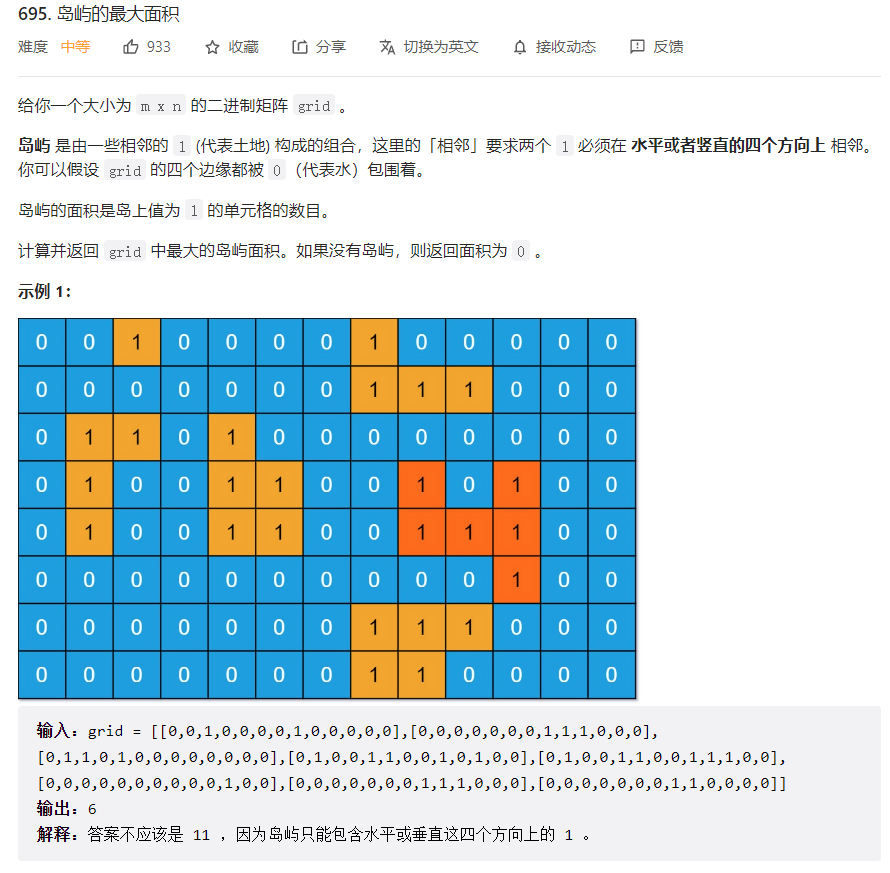
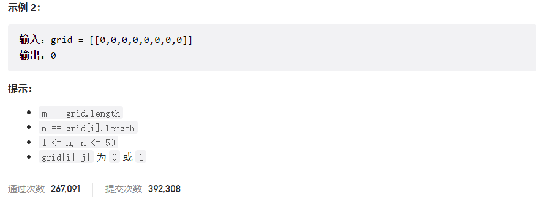



## 题目描述

> 🔥 [695. 岛屿的最大面积](https://leetcode.cn/problems/max-area-of-island/)





## 思路分析

> 感染

## 参考代码

```go
func maxAreaOfIsland(grid [][]int) int {
	if len(grid) == 0 || len(grid[0]) == 0 {
		return 0
	}

	maxArea := 0

	for i := 0; i < len(grid); i++ {
		for j := 0; j < len(grid[0]); j++ {
			if grid[i][j] == 1 {
				area := dfs(grid, i, j)
				maxArea = max(maxArea, area)
			}
		}
	}

	return maxArea
}

func dfs(grid [][]int, row, col int) int {
	if row < 0 || row >= len(grid) || col < 0 || col >= len(grid[0]) || grid[row][col] != 1 {
		return 0
	}

	// 将当前位置标记为已访问
	grid[row][col] = 0

	// 递归搜索相邻的岛屿
	area := 1
	area += dfs(grid, row+1, col)
	area += dfs(grid, row-1, col)
	area += dfs(grid, row, col+1)
	area += dfs(grid, row, col-1)

	return area
}

func max(a, b int) int {
	if a > b {
		return a
	}
	return b
}
```

<a class="button show-hidden">🍏 点击查看 Java 题解</a>

```java
class Solution {
    public int maxAreaOfIsland(int[][] grid) {
        int m = grid.length;
        int n = grid[0].length;
        int res = 0;
        for (int i = 0; i < m; i++) {
            for (int j = 0; j < n; j++) {
                if (grid[i][j] == 1) {
                    int area = dfs(grid, i, j);
                    res = Math.max(res, area);
                }
            }
        }
        return res;
    }

    public int dfs(int[][] grid, int i, int j) {
        if (i < 0 || i >= grid.length || j < 0 || j >= grid[0].length || grid[i][j] != 1) {
            return 0;
        }
        grid[i][j] = 2;
        int area = 1;
        area += dfs(grid, i - 1, j);
        area += dfs(grid, i + 1, j);
        area += dfs(grid, i, j - 1);
        area += dfs(grid, i, j + 1);
        return area;
    }
}
```

## 相似题目

| 题目                                                         | 难度   | 题解 |
| ------------------------------------------------------------ | ------ | ---- |
| [岛屿数量](https://leetcode.cn/problems/number-of-islands/) | Medium |      |
| [岛屿的周长](https://leetcode.cn/problems/island-perimeter/) | Easy |      |
