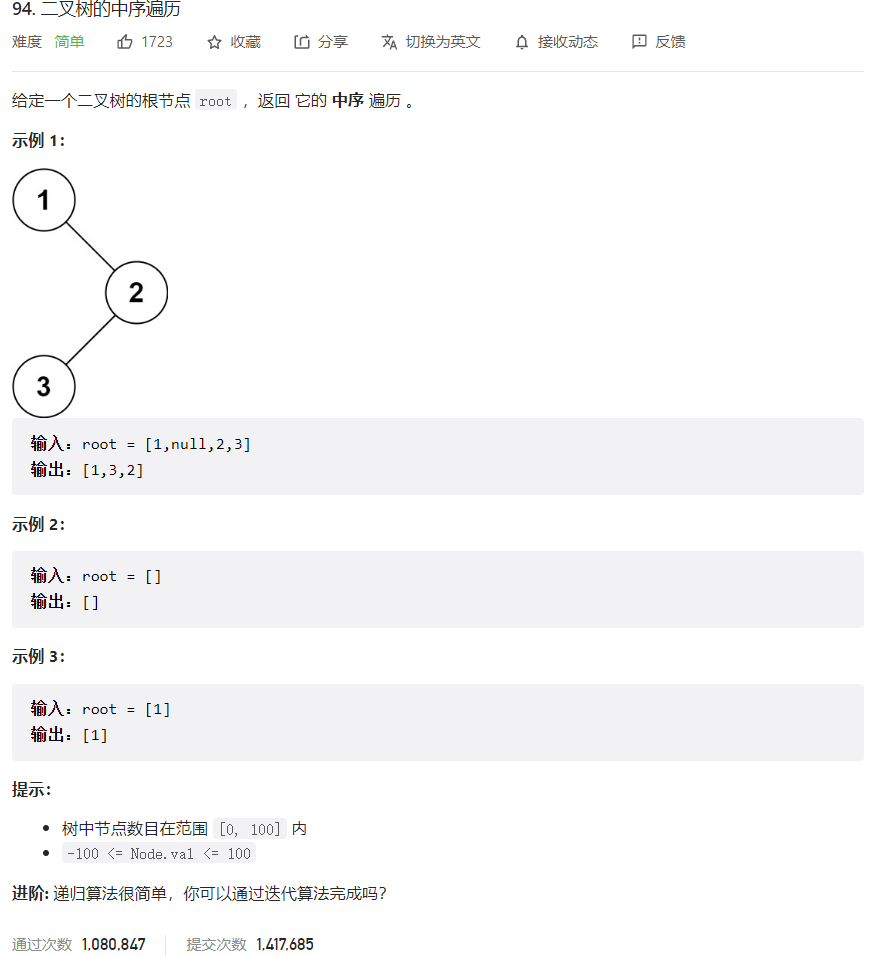



## 题目描述

> 🔥 [94. 二叉树的中序遍历](https://leetcode.cn/problems/binary-tree-inorder-traversal/)



## 思路分析

> 递归

## 参考代码

```go
func inorderTraversal(root *TreeNode) []int {
	var res []int         // 用于存储遍历结果的切片
	var stack []*TreeNode // 栈用于辅助遍历
	cur := root           // 从根节点开始遍历
	for cur != nil || len(stack) > 0 {
		// 将左子树的所有左节点入栈
		for cur != nil {
			stack = append(stack, cur)
			cur = cur.Left
		}
		// 弹出栈顶节点并将其值加入结果切片
		cur = stack[len(stack)-1]
		stack = stack[:len(stack)-1]
		res = append(res, cur.Val)
		// 遍历右子树
		cur = cur.Right
	}
	return res
}
```

<a class="button show-hidden">🍏 点击查看 Java 题解</a>

```java
class Solution {
    public List<Integer> inorderTraversal(TreeNode root) {
        List<Integer> res = new ArrayList<>();
        if (root == null) {
            return res;
        }
        Stack<TreeNode> stack = new Stack<>();
        TreeNode cur = root;
        while (!stack.isEmpty() || cur != null) {
            while (cur != null) {
                stack.push(cur);
                cur = cur.left;
            }
            TreeNode node = stack.pop();
            res.add(node.val);
            cur = node.right;
        }
        return res;
    }
}
```

## 相似题目

| 题目                                                         | 难度   | 题解 |
| ------------------------------------------------------------ | ------ | ---- |
| [验证二叉搜索树](https://leetcode.cn/problems/validate-binary-search-tree/) | Medium |      |
| [二叉树的前序遍历](https://leetcode.cn/problems/binary-tree-preorder-traversal/) | Easy |      |
| [二叉树的后序遍历](https://leetcode.cn/problems/binary-tree-postorder-traversal/) | Easy |      |
| [二叉搜索树迭代器](https://leetcode.cn/problems/binary-search-tree-iterator/) | Medium |      |
| [二叉搜索树中第 K 小的元素](https://leetcode.cn/problems/kth-smallest-element-in-a-bst/) | Medium |      |
| [最接近的二叉搜索树值 II](https://leetcode.cn/problems/closest-binary-search-tree-value-ii/) | Hard |      |
| [二叉搜索树中的中序后继](https://leetcode.cn/problems/inorder-successor-in-bst/) | Medium |      |
| [将二叉搜索树转化为排序的双向链表](https://leetcode.cn/problems/convert-binary-search-tree-to-sorted-doubly-linked-list/) | Medium |      |
| [二叉搜索树节点最小距离](https://leetcode.cn/problems/minimum-distance-between-bst-nodes/) | Easy |      |
