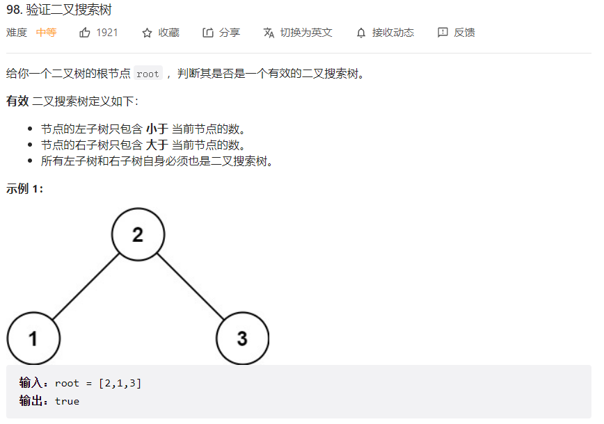
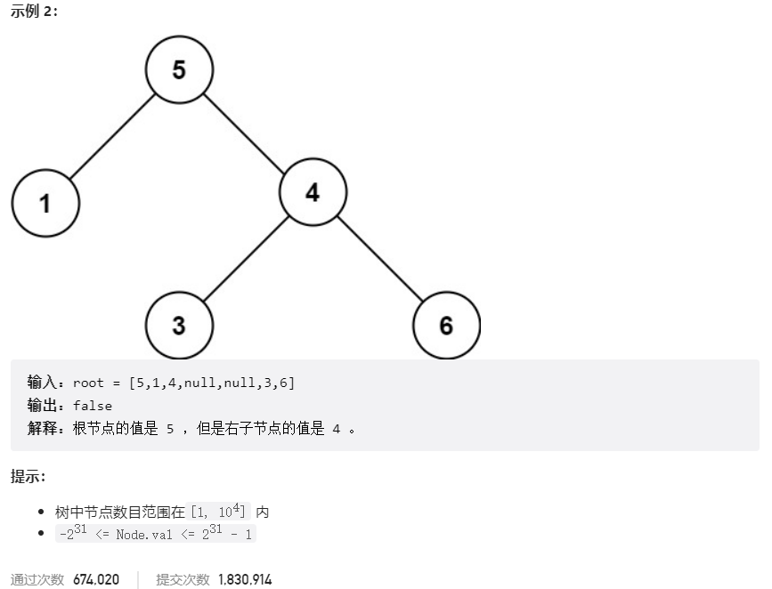



## 题目描述

> 🔥 [98. 验证二叉搜索树](https://leetcode.cn/problems/validate-binary-search-tree/)





## 思路分析

> 中序遍历为升序

## 参考代码

```go
func isValidBST(root *TreeNode) bool {
	if root == nil {
		return true
	}
	var pre *TreeNode
	cur := root
	var stack []*TreeNode
	for cur != nil || len(stack) > 0 {
		for cur != nil {
			stack = append(stack, cur)
			cur = cur.Left
		}
		node := stack[len(stack)-1]
		stack = stack[:len(stack)-1]
		if pre != nil && node.Val <= pre.Val {
			return false
		}
		pre = node
		cur = node.Right
	}
	return true
}
```

<a class="button show-hidden">🍏 点击查看 Java 题解</a>

```java
write your code here
```

## 相似题目

| 题目                                                         | 难度   | 题解 |
| ------------------------------------------------------------ | ------ | ---- |
| [二叉树的中序遍历](https://leetcode.cn/problems/binary-tree-inorder-traversal/) | Easy |      |
| [二叉搜索树中的众数](https://leetcode.cn/problems/find-mode-in-binary-search-tree/) | Easy |      |
