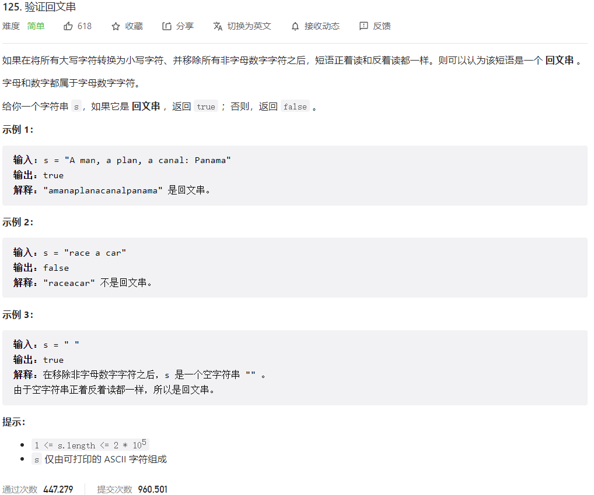



## 题目描述

> 🔥 [125. 验证回文串](https://leetcode.cn/problems/valid-palindrome/)



## 思路分析

> 双指针

## 参考代码

```go
func isPalindrome(s string) bool {
	s = strings.ToLower(s)
	left, right := 0, len(s)-1
	for left < right {
		for left < right && !isLetterOrDigit(s[left]) {
			left++
		}
		for left < right && !isLetterOrDigit(s[right]) {
			right--
		}
		if s[left] != s[right] {
			return false
		}
		left++
		right--
	}
	return true
}

func isLetterOrDigit(c byte) bool {
	return (c >= 'a' && c <= 'z') || (c >= '0' && c <= '9')
}
```

<a class="button show-hidden">🍏 点击查看 Java 题解</a>

```java
class Solution {
    public boolean isPalindrome(String s) {
        s = s.toLowerCase();
        int i = 0, j = s.length() - 1;
        while (i < j) {
            while (i < j && !Character.isLetterOrDigit(s.charAt(i))) {
                i++;
            }
            while (i < j && !Character.isLetterOrDigit(s.charAt(j))) {
                j--;
            }
            if (s.charAt(i) != s.charAt(j)) {
                return false;
            }
            i++;
            j--;
        }
        return true;
    }
}
```

```java
class Solution {
    public static boolean isPalindrome(String s) {
        // 删除非字母数字字符并将字符串转换为小写
        s = s.replaceAll("[^a-zA-Z0-9]", "").toLowerCase();
        // 检查回文性质
        int i = 0, j = s.length() - 1;
        while (i < j) {
            if (s.charAt(i) != s.charAt(j)) {
                return false;
            }
            i++;
            j--;
        }
        return true;
    }
}
```

## 相似题目

| 题目                                                         | 难度   | 题解 |
| ------------------------------------------------------------ | ------ | ---- |
| [回文链表](https://leetcode.cn/problems/palindrome-linked-list/) | Easy |      |
| [验证回文串 II](https://leetcode.cn/problems/valid-palindrome-ii/) | Easy |      |
